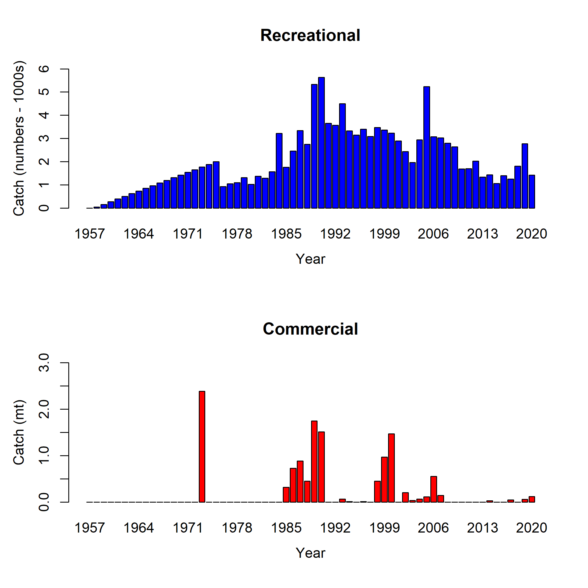

\clearpage
# Figures


<!-- ====================================================================== -->  
<!-- ****************** Catches Used in the Model ************************* --> 
<!-- ====================================================================== -->  

{width=100% height=100% alt="Total removals by year for the recreational (1000s of fish) and commercial fleets (mt) in the model"}

<!-- ====================================================================== --> 
<!-- ******************* Data Used in the Model *************************** --> 
<!-- ====================================================================== --> 

```{r, results = 'asis'}
add_figure(
filein = file.path(mod_loc, "plots", "data_plot.png"), 
caption = "Summary of data sources used in the base model",
label = 'data-plot')
```	


<!-- ====================================================================== -->
<!-- ****************   Commercial Length Samples    ********************** --> 
<!-- ====================================================================== -->

```{r, results = 'asis'}
add_figure(
filein = file.path(mod_loc, "plots", "comp_lendat_bubflt2mkt0.png"), 
caption = "Length composition data from the commercial fleet",
label = 'com-len-data')
```

```{r, results = 'asis'}
add_figure(
filein = file.path(mod_loc, "plots", "comp_lendat__aggregated_across_time.png"), 
caption = "Aggregate length composition for the commercial and recreational fleet over all years",
label = 'wa-len-agg')
```

```{r, results = 'asis'}
add_figure(
filein = file.path(mod_loc, "plots", "comp_lendat_data_weighting_TA1.8_WA_Commercial.png"), 
caption = "Mean length for commercial fleet with 95 percent confidence intervals",
label = 'mean-com-len-data')
```

<!-- ====================================================================== -->
<!-- **************** Recreational Length Samples    ********************** --> 
<!-- ====================================================================== -->

```{r, results = 'asis'}
add_figure(
filein = file.path(mod_loc, "plots", "comp_lendat_bubflt1mkt0_page2.png"), 
caption = "Length composition data from the recreational fleet",
label = 'rec-len-data')
```

```{r, results = 'asis'}
add_figure(
filein = file.path(mod_loc, "plots", "comp_lendat_data_weighting_TA1.8_WA_Recreational.png"), 
caption = "Mean length for recreational fleet with 95 percent confidence intervals",
label = 'mean-rec-len-data')
```

<!-- ====================================================================== -->
<!-- *************************     Biology     **************************** --> 
<!-- ====================================================================== -->

```{r, results = 'asis'}
add_figure(
filein = file.path(mod_loc, "plots", "bio6_maturity.png"), 
caption = "Maturity as a function of  length",
label = 'maturity')
```

```{r, results = 'asis'}
add_figure(
filein = file.path(mod_loc, "plots", "bio9_fecundity_len.png"), 
caption = "Fecundity as a function of length",
label = 'fecundity')
```

```{r, results = 'asis'}
add_figure(
filein = file.path(data_fig_loc, "Length_Weight_by_Sex_ForReport.png"), 
caption = "Observed sex-specific weight-at-length data from the individual sources with length and weight data, along with all sources combined with the estimated weight-at-length curves",
label = 'len-weight-survey')
```	

```{r, results = 'asis'}
add_figure(
filein = file.path(mod_loc, "plots", "bio5_weightatsize.png"), 
caption = "Weight-at-length relationship used in the model",
label = 'len-weight')
```	

```{r, results = 'asis'}
add_figure(
filein = file.path(data_fig_loc, "Length_Age_by_Sex_ForReport.png"), 
caption = "Observed sex-specific length-at-age data from the individual sources with length and age data, along with all sources combined with the estimated length-at-age curves",
label = 'len-age-data')
```	

```{r, results = 'asis'}
add_figure(
filein = file.path(mod_loc, "plots", "bio1_sizeatage.png"), 
caption = "Length at age in the beginning of the year in the ending year of the model",
label = 'len-age-ss')
```


<!-- ====================================================================== -->
<!-- *********************    Selectivity            ********************** --> 
<!-- ====================================================================== -->

```{r, results = 'asis'}
add_figure(
filein = file.path(mod_loc, "plots", "sel01_multiple_fleets_length1.png"),
caption = "Selectivity at length by fleet",
label = 'selex')
```

<!-- ```{r, results = 'asis'} -->
<!-- add_figure( -->
<!-- filein = file.path(mod_loc, "plots", "recdevs2_withbars.png"),  -->
<!-- caption = "Estimated time series of recruitment deviations", -->
<!-- label = 'rec-devs') -->
<!-- ``` -->

<!-- ```{r, results = 'asis'} -->
<!-- add_figure( -->
<!-- filein = file.path(mod_loc, "plots", "recruit_fit_bias_adjust.png"), -->
<!-- caption = "Recruitment bias adjustment applied in the base model", -->
<!-- label = 'bias-adj') -->
<!-- ``` -->


<!-- ====================================================================== -->
<!-- ****************** Fit to the Length Data **************************** --> 
<!-- ====================================================================== -->


```{r, results = 'asis'}
add_figure(
filein = file.path(mod_loc, "plots", "comp_lenfit_residsflt2mkt0.png"), 
caption = "Pearson residuals for commercial fleet. Closed bubble are positive residuals (observed > expected) and open bubbles are negative residuals (observed < expected)",
label = 'com-pearson')
```

```{r, results = 'asis'}
add_figure(
filein = file.path(mod_loc, "plots", "comp_lenfit_data_weighting_TA1.8_WA_Commercial.png"), 
caption = "Model estimated mean length in cm (blue line) overlaid on mean length of commercial lengths (gray circles) with 95 percent confidence intervals based on current samples sizes",
label = 'com-mean-len-fit')
```

```{r, results = 'asis'}
add_figure(
filein = file.path(mod_loc, "plots", "comp_lenfit_residsflt1mkt0_page2.png"), 
caption = "Pearson residuals for recreational fleet. Closed bubble are positive residuals (observed > expected) and open bubbles are negative residuals (observed < expected)",
label = 'rec-pearson')
```

```{r, results = 'asis'}
add_figure(
filein = file.path(mod_loc, "plots", "comp_lenfit_data_weighting_TA1.8_WA_Recreational.png"), 
caption = "Model estimated mean length in cm (blue line) overlaid on mean length for recreational lengths (gray circles) with 95 percent confidence intervals based on current samples sizes",
label = 'rec-mean-len-fit')
```

```{r, results = 'asis'}
add_figure(
filein = file.path(mod_loc, "plots", "comp_lenfit__aggregated_across_time.png"), 
caption = "Aggregated length comps over all years",
label = 'agg-len-fit')
```

<!-- ====================================================================== -->
<!-- ******************      Time Series       **************************** --> 
<!-- ====================================================================== -->

```{r, results = 'asis'}
add_figure(
filein = file.path(mod_loc, "plots", "ts7_Spawning_output_with_95_asymptotic_intervals_intervals.png"), 
caption = "Estimated time series of spawning output",
label = 'ssb')
```

```{r, results = 'asis'}
add_figure(
filein = file.path(mod_loc, "plots", "ts1_Total_biomass_(mt).png"), 
caption = "Estimated time series of total biomass",
label = 'tot-bio')
```

```{r, results = 'asis'}
add_figure(
filein = file.path(mod_loc, "plots", "ts9_Relative_spawning_output_intervals.png"), 
caption = "Estimated time series of relative spawning output",
label = 'depl')
```

<!-- ```{r, results = 'asis'} -->
<!-- add_figure( -->
<!-- filein = file.path(mod_loc, "plots", "UnavailableSpawningOutput.png"), -->
<!-- caption = "Proportion of biomass unavailable due to selectivity for small and large fish.", -->
<!-- label = 'unavail-bio') -->
<!-- ``` -->

```{r, results = 'asis'}
add_figure(
filein = file.path(mod_loc, "plots", "SR_curve.png"), 
caption = "Stock-recruit curve. Point colors indicate year, with warmer colors indicating earlier years and cooler colors in showing later years",
label = 'bh-curve')
```

```{r, results = 'asis'}
add_figure(
filein = file.path(mod_loc, "plots", "ts11_Age-0_recruits_(1000s)_with_95_asymptotic_intervals.png"), 
caption = "Estimated time series of age-0 recruits (1000s)",
label = 'recruits')
```


<!-- ====================================================================== -->
<!-- ******************      Likelihoods      ***************************** --> 
<!-- ====================================================================== -->

<!-- R0 -->
```{r, results = 'asis'}
add_figure(
filein = file.path(paste0(mod_loc, "Profile_profile_SR_LN(R0)"),  "piner_panel_SR_LN(R0).png"), 
caption = "Change in the negative log-likelihood across a range of ln(R0) values",
label = 'r0-profile')
```

```{r, results = 'asis'}
add_figure(
filein = file.path(paste0(mod_loc, "Profile_profile_SR_LN(R0)"),  "SR_LN(R0)_trajectories_compare1_spawnbio.png"), 
caption = "Change in the estimate of spawning output across a range of ln(R0) values",
label = 'r0-ssb')
```

```{r, results = 'asis'}
add_figure(
filein = file.path(paste0(mod_loc, "Profile_profile_SR_LN(R0)"),  "SR_LN(R0)_trajectories_compare3_Bratio.png"), 
caption = "Change in the estimate of fraction unfished across a range of ln(R0) values",
label = 'r0-depl')
```

<!-- h -->
```{r, results = 'asis'}
add_figure(
filein = file.path(paste0(mod_loc, "Profile_profile_SR_BH_steep"),  "piner_panel_SR_BH_steep.png"), 
caption = "Change in the negative log-likelihood across a range of steepness values",
label = 'h-profile')
```

```{r, results = 'asis'}
add_figure(
filein = file.path(paste0(mod_loc, "Profile_profile_SR_BH_steep"),  "SR_BH_steep_trajectories_compare1_spawnbio.png"), 
caption = "Change in the estimate of spawning output across a range of steepness values",
label = 'h-ssb')
```

```{r, results = 'asis'}
add_figure(
filein = file.path(paste0(mod_loc, "Profile_profile_SR_BH_steep"),  "SR_BH_steep_trajectories_compare3_Bratio.png"), 
caption = "Change in the estimate of fraction unfished across a range of steepness values",
label = 'h-depl')
```

<!-- h rec selex fixed (parm 1 and 3) -->
```{r, results = 'asis'}
add_figure(
filein = file.path(paste0(mod_loc, "Profile_fixRecSelex_profile_SR_BH_steep"),  "piner_panel_SR_BH_steep.png"),
caption = "Change in the negative log-likelihood across a range of steepness values with recreational selectivity fixed",
label = 'h-recfix-profile')
```

```{r, results = 'asis'}
add_figure(
filein = file.path(paste0(mod_loc, "Profile_fixRecSelex_profile_SR_BH_steep"),  "SR_BH_steep_trajectories_compare1_spawnbio.png"),
caption = "Change in the estimate of spawning output across a range of steepness values with recreational selectivity fixed",
label = 'h-recfix-ssb')
```

```{r, results = 'asis'}
add_figure(
filein = file.path(paste0(mod_loc, "Profile_fixRecSelex_profile_SR_BH_steep"),  "SR_BH_steep_trajectories_compare3_Bratio.png"),
caption = "Change in the estimate of fraction unfished across a range of steepness values with recreational selectivity fixed",
label = 'h-recfix-depl')
```

<!-- Rec selex -->
```{r, results = 'asis'}
add_figure(
filein = file.path(paste0(mod_loc, "Profile_profile_Size_DblN_peak_WA_Recreational(1)"),  "piner_panel_Size_DblN_peak_WA_Recreational(1).png"),
caption = "Change in the negative log-likelihood across a range of values for the peak in selectivity for the recreational fishery",
label = 'recselex-profile')
```

```{r, results = 'asis'}
add_figure(
filein = file.path(paste0(mod_loc, "Profile_profile_Size_DblN_peak_WA_Recreational(1)"),  "Size_DblN_peak_WA_Recreational(1)_trajectories_compare1_spawnbio.png"),
caption = "Change in the estimate of spawning output across a range of values for the peak in selectivity for the recreational fishery",
label = 'recselex-ssb')
```

```{r, results = 'asis'}
add_figure(
filein = file.path(paste0(mod_loc, "Profile_profile_Size_DblN_peak_WA_Recreational(1)"),  "Size_DblN_peak_WA_Recreational(1)_trajectories_compare3_Bratio.png"),
caption = "Change in the estimate of fraction unfished across a range of values for the peak in selectivity for the recreational fishery",
label = 'recselex-depl')
```

<!-- M -->
```{r, results = 'asis'}
add_figure(
filein = file.path(paste0(mod_loc, "Profile_profile_NatM_p_1_Fem_GP_1"),  "piner_panel_NatM_p_1_Fem_GP_1.png"), 
caption = "Change in the negative log-likelihood across a range of natural mortality values",
label = 'm-profile')
```

```{r, results = 'asis'}
add_figure(
filein = file.path(paste0(mod_loc, "Profile_profile_NatM_p_1_Fem_GP_1"),  "NatM_p_1_Fem_GP_1_trajectories_compare1_spawnbio.png"), 
caption = "Change in the estimate of spawning output across a range of natural mortality values",
label = 'm-ssb')
```

```{r, results = 'asis'}
add_figure(
filein = file.path(paste0(mod_loc, "Profile_profile_NatM_p_1_Fem_GP_1"),  "NatM_p_1_Fem_GP_1_trajectories_compare3_Bratio.png"), 
caption = "Change in the estimate of fraction unfished across a range of natural mortality values",
label = 'm-depl')
```

<!-- Linf -->
```{r, results = 'asis'}
add_figure(
filein = file.path(paste0(mod_loc, "Profile_profile_L_at_Amax_Fem_GP_1"),  "piner_panel_L_at_Amax_Fem_GP_1.png"), 
caption = "Change in the negative log-likelihood across a range of maximum length values",
label = 'linf-profile')
```

```{r, results = 'asis'}
add_figure(
filein = file.path(paste0(mod_loc, "Profile_profile_L_at_Amax_Fem_GP_1"),  "L_at_Amax_Fem_GP_1_trajectories_compare1_spawnbio.png"), 
caption = "Change in the estimate of spawning output across a range of maximum length values",
label = 'linf-ssb')
```

```{r, results = 'asis'}
add_figure(
filein = file.path(paste0(mod_loc, "Profile_profile_L_at_Amax_Fem_GP_1"),  "L_at_Amax_Fem_GP_1_trajectories_compare3_Bratio.png"), 
caption = "Change in the estimate of fraction unfished across a range of maximum length values",
label = 'linf-depl')
```

<!-- k -->
```{r, results = 'asis'}
add_figure(
filein = file.path(paste0(mod_loc, "Profile_profile_VonBert_K_Fem_GP_1"),  "piner_panel_VonBert_K_Fem_GP_1.png"), 
caption = "Change in the negative log-likelihood across a range of k values",
label = 'k-profile')
```

```{r, results = 'asis'}
add_figure(
filein = file.path(paste0(mod_loc, "Profile_profile_VonBert_K_Fem_GP_1"),  "VonBert_K_Fem_GP_1_trajectories_compare1_spawnbio.png"), 
caption = "Change in the estimate of spawning output across a range of k values",
label = 'k-ssb')
```

```{r, results = 'asis'}
add_figure(
filein = file.path(paste0(mod_loc, "Profile_profile_VonBert_K_Fem_GP_1"),  "VonBert_K_Fem_GP_1_trajectories_compare3_Bratio.png"), 
caption = "Change in the estimate of fraction unfished across a range of k values",
label = 'k-depl')
```

<!-- CV-old -->
```{r, results = 'asis'}
add_figure(
filein = file.path(paste0(mod_loc, "Profile_profile_CV_old_Fem_GP_1"),  "piner_panel_CV_old_Fem_GP_1.png"), 
caption = "Change in the negative log-likelihood across a range of CV at maximum length values",
label = 'cv2-profile')
```

```{r, results = 'asis'}
add_figure(
filein = file.path(paste0(mod_loc, "Profile_profile_CV_old_Fem_GP_1"),  "CV_old_Fem_GP_1_trajectories_compare1_spawnbio.png"), 
caption = "Change in the estimate of spawning output across a range of CV at maximum length values",
label = 'cv2-ssb')
```

```{r, results = 'asis'}
add_figure(
filein = file.path(paste0(mod_loc, "Profile_profile_CV_old_Fem_GP_1"),  "CV_old_Fem_GP_1_trajectories_compare3_Bratio.png"), 
caption = "Change in the estimate of fraction unfished across a range of CV at maximum length values",
label = 'cv2-depl')
```

<!-- CV old rec selex fixed (parm 1 and 3) -->
```{r, results = 'asis'}
add_figure(
filein = file.path(paste0(mod_loc, "Profile_fixRecSelex_profile_CV_old_Fem_GP_1"),  "piner_panel_CV_old_Fem_GP_1.png"),
caption = "Change in the negative log-likelihood across a range of CV at maximum length values with recreational selectivity fixed",
label = 'cv2-recfix-profile')
```

```{r, results = 'asis'}
add_figure(
filein = file.path(paste0(mod_loc, "Profile_fixRecSelex_profile_CV_old_Fem_GP_1"),  "CV_old_Fem_GP_1_trajectories_compare1_spawnbio.png"),
caption = "Change in the estimate of spawning output across a range of CV at maximum length values with recreational selectivity fixed",
label = 'cv2-recfix-ssb')
```

```{r, results = 'asis'}
add_figure(
filein = file.path(paste0(mod_loc, "Profile_fixRecSelex_profile_CV_old_Fem_GP_1"),  "CV_old_Fem_GP_1_trajectories_compare3_Bratio.png"),
caption = "Change in the estimate of fraction unfished across a range of CV at maximum length values with recreational selectivity fixed",
label = 'cv2-recfix-depl')
```


<!-- ====================================================================== -->
<!-- ******************     Retrospectives    ***************************** --> 
<!-- ====================================================================== -->

```{r, results = 'asis'}
add_figure(
filein = file.path(paste0(mod_loc, "Profile_retro"),  "compare2_spawnbio_uncertainty.png"), 
caption = "Change in the estimate of spawning output when the most recent 5 years of data are removed sequentially",
label = 'retro-ssb')
```

```{r, results = 'asis'}
add_figure(
filein = file.path(paste0(mod_loc, "Profile_retro"),  "compare4_Bratio_uncertainty.png"),
caption = "Change in the estimate of fraction unfished when the most recent 5 years of data are removed sequentially",
label = 'retro-depl')
```

\newpage


<!-- ====================================================================== -->
<!-- ******************       Sensitivity     ***************************** --> 
<!-- ====================================================================== -->

```{r, echo=FALSE, results='asis'}
sens_wd = file.path("C:/Users/Brian.Langseth/Desktop/wa", "sensitivities")
nm = "base.1000_sensitivities_compare2_spawnbio_uncertainty.png"
add_figure(
filein = file.path(sens_wd, nm),
caption = "Change in estimated spawning output by sensitivity",
label = 'sens-ssb')
```

```{r, echo=FALSE, results='asis'}
sens_wd = file.path("C:/Users/Brian.Langseth/Desktop/wa", "sensitivities")
nm = "base.1000_sensitivities_compare2_spawnbio_uncertainty_subset.png"
add_figure(
filein = file.path(sens_wd, nm),
caption = "Change in estimated spawning output by sensitivity. Sensitivities for Linf, CV of older fish, and alternative phase/state are omitted",
label = 'sens-ssb-subset')
```

```{r, echo=FALSE, results='asis'}
nm = "base.1000_sensitivities_compare4_Bratio_uncertainty.png"
add_figure(
filein = file.path(sens_wd, nm),
caption = "Change in estimated fraction unfished by sensitivity",
label = 'sens-depl')
```

```{r, echo=FALSE, results='asis'}
nm = "base.1000_sensitivities_compare4_Bratio_uncertainty_subset.png"
add_figure(
filein = file.path(sens_wd, nm),
caption = "Change in estimated fraction unfished by sensitivity. Sensitivities for Linf, CV of older fish, and alternative phase/state are omitted",
label = 'sens-depl-subset')
```

```{r, echo=FALSE, results='asis'}
nm = "base.1000_sensitivities_compare12_recdevs_uncertainty.png"
add_figure(
filein = file.path(sens_wd, nm),
caption = "Change in estimated annual recruitment deviation",
label = 'sens-recdev')
```


<!-- ====================================================================== -->
<!-- ******************         SSS           ***************************** --> 
<!-- ====================================================================== -->


```{r, echo=FALSE, results='asis'}
sss_loc = "C:/Users/Brian.Langseth/Desktop/WA_SSS"

add_figure(
filein = file.path(sss_loc, "WA_Quillback_SSS_biocatchGMT_57dep_LWcorrect/plots/SSS_57_Priors.png"), 
caption = "Prior distributions for parameter input for SSS where fraction unfished was assumed to be 57 percent. The red vertical line represents the median of the distribution",
label = "sss-prior-57")
```

\newpage

```{r, echo=FALSE, results='asis'}
add_figure(
filein = file.path(sss_loc, "WA_Quillback_SSS_biocatchGMT_57dep_LWcorrect/plots/SSS_57_quants.png"), 
caption = "Derived quantities from SSS run where fraction unfished was assumed to be 57 percent",
label = "sss-quant-57")
```

\newpage

```{r, echo=FALSE, results='asis'}
add_figure(
filein = file.path(sss_loc, "WA_Quillback_SSS_biocatchGMT_40dep_LWcorrect/plots/SSS_40_Priors.png"), 
caption = "Prior distributions for parameter input for SSS where fraction unfished was assumed to be 40 percent. The red vertical line represents the median of the distribution",
label = "sss-prior-40")
```

\newpage

```{r, echo=FALSE, results='asis'}
add_figure(
filein = file.path(sss_loc, "WA_Quillback_SSS_biocatchGMT_40dep_LWcorrect/plots/SSS_40_quants.png"), 
caption = "Derived quantities from SSS run where fraction unfished was assumed to be 40 percent",
label = "sss-quant-40")
```


<!-- ====================================================================== -->
<!-- ******************    Reference Points    **************************** --> 
<!-- ====================================================================== -->


```{r, results = 'asis'}
add_figure(
filein = file.path(mod_loc, "plots", "SPR2_minusSPRseries.png"), 
caption = "Estimated 1 - relative spawning ratio (SPR) by year",
label = '1-spr')
```

```{r, results = 'asis'}
add_figure(
filein = file.path(mod_loc, "plots", "SPR4_phase.png"), 
caption = "Phase plot showing the fraction unfished versus fishing intensity for each year. Each point shows the spawning output relative to the unfished spawning output and the SPR ratio for each year. Lines through the final point show the 95 percent confidence intervals based on the asymptotic uncertainty for each dimension. The shaded ellipse is a 95 percent confidence region which accounts for the estimated correlations between the spawning output and SPR ratios.",
label = 'phase-plot')
```

```{r, results = 'asis'}
add_figure(
filein = file.path(mod_loc, "plots", "yield2_yield_curve_with_refpoints.png"), 
caption = "Equilibrium yield curve for the base case model. Values are based on the 2020
fishery selectivity and with steepness fixed at 0.72",
label = 'yield')
```

\newpage