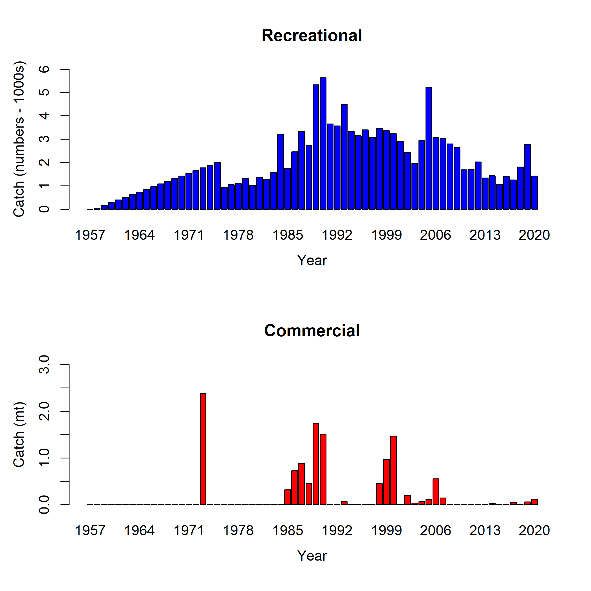

<!--chapter:end:00a.Rmd-->

---
author:
  - name: Brian J. Langseth
    code: 1
    first: B
    middle: J
    family: Langseth
  - name: Chantel R. Wetzel
    code: 1
    first: C
    middle: R
    family: Wetzel
  - name: Jason M. Cope
    code: 1
    first: J
    middle: M
    family: Cope
  - name: Tien-Shui Tsou
    code: 2
    first: T
    middle: '-'
    family: Tsou
  - name: Lisa K. Hillier
    code: 2
    first: L
    middle: K
    family: Hillier
author_list: Langseth, B.J., C.R. Wetzel, J.M. Cope, T.S. Tsou, L.K. Hillier
affiliation:
  - code: 1
    address: Northwest Fisheries Science Center, U.S. Department of Commerce, National
      Oceanic and Atmospheric Administration, National Marine Fisheries Service, 2725
      Montlake Boulevard East, Seattle, Washington 98112
  - code: 2
    address: Washington Department of Fish and Wildlife, 600 Capital Way North, Olympia,
      Washington 98501
address:
  - ^1^Northwest Fisheries Science Center, U.S. Department of Commerce, National Oceanic
    and Atmospheric Administration, National Marine Fisheries Service, 2725 Montlake
    Boulevard East, Seattle, Washington 98112
  - ^2^Washington Department of Fish and Wildlife, 600 Capital Way North, Olympia,
    Washington 98501
---

<!--chapter:end:00authors.Rmd-->

---
title: Status of quillback rockfish (_Sebastes maliger_) in U.S. waters off the coast of Washington in 2021 using catch and length data
---

<!--chapter:end:00title.Rmd-->


\pagenumbering{roman}
\setcounter{page}{1}

\renewcommand{\thetable}{\roman{table}}
\renewcommand{\thefigure}{\roman{figure}}

\setlength\parskip{0.5em plus 0.1em minus 0.2em}

\vspace{500cm}

\pagebreak

<!--chapter:end:01a.Rmd-->

\pagebreak
\pagenumbering{arabic}
\setcounter{page}{1}
\renewcommand{\thefigure}{\arabic{figure}}
\renewcommand{\thetable}{\arabic{table}}
\setcounter{table}{0}
\setcounter{figure}{0}

<!--chapter:end:10a.Rmd-->

# Introduction

## Basic Information

This assessment reports the status of quillback rockfish (*Sebastes maliger*) off the Washington coast using data through 2020. 

The stock off the Washington coast was assessed as a separate stock from other populations off the U.S. West Coast based on two factors. First, the fairly sedentary nature of quillback rockfish [@HannahandRankin_rockfish_site_fidelity_2011; @tolimieri_home_2009] likely limits movement of fish between Washington and Oregon. Additionally, the primary region of recreational fishing off the Washington coast occurs in the central to northern regions. These areas have rocky habitat with which rockfish species such as quillback rockfish associate. In contrast the southern coast of Washington consists primarily of soft and sandy substrate. Second, the exploitation history and magnitude of removals off the Washington coast differ from those in Oregon and California.    

<!-- Life history -->


## Life History

Quillback rockfish are a medium- to large-sized nearshore rockfish found from southern California to the Gulf of Alaska [@loveetal_2002]. Off the U.S. West Coast quillback rockfish are primarily located north of central California, with few observations south of Point Conception. Quillback rockfish have historically been part of both commercial and recreational fisheries throughout their range. 

Quillback rockfish are found in waters less than 274 meters in depth in nearshore kelp forests and rocky habitat [@loveetal_2002]. The diets of quillback rockfish consist primarily of benthic and pelagic crustaceans and fish [@Murie_diet_1995]. The body coloring of adult quillback rockfish is brown with yellow to orange blotching and light-colored dorsal saddle patches [@loveetal_2002]. As their name suggests, quillback rockfish have long dorsal fin spines.

Limited studies have evaluated genetic variation in quillback rockfish across the U.S. West Coast. Genetic work has revealed significant differences between Puget Sound and coastal stocks of quillback rockfish [@seeb_gene_1998; @Stoutetal_DPS_2001], however Seeb [-@seeb_gene_1998] did not find significant differentiation in populations of quillback rockfish between coastal Washington and Alaska. Significant population sub-division along the U.S. West Coast has been detected for the closely related, and more well-studied copper rockfish (*Sebastes caurinus*), indicating limited oceanographic exchange among geographically proximate locations [@seeb_gene_1998; @buonaccorsi_population_2002; @johansson_influence_2008]. High site-fidelity [@HannahandRankin_rockfish_site_fidelity_2011] and relatively small home ranges [@tolimieri_home_2009] for quillback rockfish suggests patterns of isolation-by-distance as found for other rockfish.

Quillback rockfish are a long-lived rockfish estimated to live up to 95 years [@loveetal_2002; @YamanakaandLacko_rockfish_2001]. Quillback rockfish was determined to have a vulnerability (V = 2.22) of major concern in a productivity susceptibility analysis [@cope_approach_2011]. This analysis calculated species specific vulnerability scores based on two dimensions: productivity characterized by the life history, and susceptibility characterized by how the stock is likely affected by the fishery in question.

## Historical and Current Fishery Information

Off the Washington coast, quillback rockfish is primarily caught in the recreational fishery, and in general, is not targeted by either commercial or recreational fleets (Table \ref{tab:allcatches} and Figure \ref{fig:catch}). Recreational landings of quillback rockfish were provided by the Washington Department of Fish and Wildlife (WDFW) and for most years were available from 1958 to present, with a linear interpolation applied for years where data were missing. Recreational harvest is focused in the central and northern regions in areas of rocky habitat. Although populations are considered to be widespread in the nearshore marine environment, abundance may be limited along the southern coast which consists primarily of soft and sandy substrate. 

Commercial landings data are available from the WDFW historical reconstruction prior to 1981 and from PacFIN from 1981 through 2020. Washington state waters, which mostly encompass the depths preferred by quillback rockfish, were closed to commercial fixed gears in 1995 and to trawling in 1999. In response to the development of the live-fish fishery in California and Oregon, Washington took preemptive action in 1999 by prohibiting the landing of live fish. There are four treaty tribes along the Washington coast that continue to fish under separate commercial rules and are not subject to the state water closure. These tribes occasionally land small amounts of quillback rockfish. Quillback rockfish are usually landed in the Nearshore Rockfish group, a mixed-species market category. Species composition samples are taken from sampled landings, and proportions of quillback rockfish reported in the nearshore market category are estimated by port, quarter, gear, and year.

<!-- Summary of Management History and Performance -->


## Summary of Management History and Performance

Quillback rockfish is managed by the Pacific Fishery Management Council (PFMC) as a part of the Minor Nearshore Rockfish North and Minor Nearshore Rockfish South complexes. The North and South complexes are split at N. 40$^\circ$ 10' Lat. off the U.S. West Coast. Each complex is managed based on a complex-level overfishing limit (OFL) and annual catch limit (ACL) that are determined by summing the species-specific OFL and ACL (ACLs set equal to the Acceptable Biological Catch) contributions for all stocks managed in the complex. Removals for species within each complex are managed and tracked against the complex total OFL and ACL, rather than on a species by species basis.

Quillback rockfish was most recently assessed in 2010 using Depletion-Based Stock Reduction Analysis (DB-SRA) to provide estimates of coastwide OFLs [@DickandMacCall_dbsra_2010]. The coastwide OFL was then apportioned to each management area based on the proportion of historical catches North and South of N. 40$^\circ$ 10' Lat. DB-SRA does not assess overfished status, but rather assumes that current depletion is distributed around the management target (e.g. 40%). The 2010 assessment found there was a 52% chance that quillback rockfish was experiencing overfishing, as recent coastwide catch of quillback rockfish slightly exceeded the median coastwide OFL estimate at the time. 

The current OFL contribution and implied ACL contribution for quillback rockfish North of 40$^\circ$ 10' Lat. N., the state specific ACL allocation (12.9% for Washington; Groundfish Management Team, pers. comm.), and the total removals are shown in Table \ref{tab:ofl}.

<!--chapter:end:11introduction.Rmd-->

# Data
The following types and sources of data were used in this assessment. Fishery catch and composition data were specific to Washington, however biological data were estimated coastwide and included Washington, Oregon, and California sources. 

1. Commercial landings, and length, weight, and age data obtained from PacFIN and the WDFW. Age compositions were not fit directly in the model, but age and weight data were used to estimate biological parameters which were fixed inputs to the model.
2. Estimates of commercial discard length frequencies and fraction discarded in the fishery obtained from the West Coast Groundfish Observer Program (WCGOP).
3. Recreational landings and discards, and length, weight, and age data obtained from RecFIN and the WDFW. Age compositions were not fit directly in the model, but age and weight data were used to estimate biological parameters which were fixed inputs to the model. 
4. Fishery-independent biological data (length, weight, and age) from the Northwest Fisheries Science Center (NWFSC) West Coast Groundfish Bottom Trawl Survey (WCGBTS). These data were used to estimate biological parameters which were fixed inputs to the model.
5. Estimates of fecundity, maturity, and natural mortality from various sources.

A description of each data type is provided below, with timing of catch and composition data used in the base model shown in Figure \ref{fig:data-plot}.

<!--chapter:end:20data.Rmd-->

## Fishery-Dependent Data

### Commercial Fishery

#### Landings

Commercial landings of quillback rockfish in Washington were provided directly by the WDFW for years ranging from 1889 to 2014 and compiled from PacFIN for years from 2015 to 2020. Only eight of the years before 1973 have non-zero landings, and all are less than 0.04 mt. Consequently, we exclude landings before 1973 for this assessment. There is limited commercial fishery removals of quillback rockfish off the Washington coast and not all years have commercial landings. The highest annual landing was 2.20 mt in 1973 with only three other years exceeding 1 mt of harvest (1989, 1990, and 2000). Washington closed state waters to commercial fixed gears in 1995 and to trawling in 1999. Quillback rockfish are occasionally encountered as bycatch in commercial fisheries outside of state waters and are harvested by four treaty tribes off the Washington coast that fish under separate commercial rules and are not subject to the state water closures. Quillback rockfish is landed as part of the mixed nearshore rockfish market category and species composition data are applied. In 2020, access to Neah Bay was closed for commercial fisheries sampling due to the COVID-19 pandemic, so an average proportion for quillback rockfish composition data taken from 2017-2019 was applied to the nearshore rockfish market category for the Neah Bay Port group in 2020.

The input catches in the model represent total removals: landings plus discards (Table \ref{tab:allcatches} and Figure \ref{fig:catch}). Discard totals for the commercial fleet for years between 2002-2019 were determined based on WCGOP data provided in the Groundfish Expanded Mortality Multiyear (GEMM) product. The total coastwide observed discards were allocated by state and area based on the total observed landings observed by WCGOP. Discards were added to landings in years where landings were non-zero to obtain total removals for 2002-2019. Total removals prior to 2002, and for 2020 where no WCGOP data were yet available, were calculated using the average discard rates from WCGOP for years within both landings and discards for Washington (8.3 percent).

#### Length Compositions 

Available length data collected from commercial fisheries from 1980-2019 were extracted from PacFIN for Washington quillback rockfish (Table \ref{tab:com-len-samps}, extracted 2/23/2021). No commercial length samples were collected in 2020 due to sampling restrictions caused by the COVID-19 pandemic. There are very few length samples of quillback rockfish from commercial fisheries in Washington. The largest number of length samples (n = 106) occurs for 2006, while every other year had fewer than 20 samples.

The distribution of the lengths in the commercial data was variable and ranged between 20 - 50 cm (the maximum length data bin size, Figure \ref{fig:com-len-data}). Given the high number of samples in 2006 compared to other years, the aggregate lengths were very similar to the length data for 2006 (Figure \ref{fig:wa-len-agg}). The mean size observed by the commercial fishery was variable within and across years (Figure \ref{fig:mean-com-len-data}). 

The input sample sizes for the commercial length data were calculated via the Stewart method (Ian Stewart, personal communication) which incorporate the number of trips and fish by year:

\begin{centering}

Input effN = $N_{\text{trips}} + 0.138 * N_{\text{fish}}$ if $N_{\text{fish}}/N_{\text{trips}}$ is $<$ 44

Input effN = $7.06 * N_{\text{trips}}$ if $N_{\text{fish}}/N_{\text{trips}}$ is $\geq$ 44

\end{centering}

Despite the variability in commercial lengths due to small sample size, the model was able to estimate selectivity for the commercial fleet. A sensitivity analysis was conducted by setting the selectivity of the commercial fleet to mirror that of the recreational fleet (see Section \ref{sensitivity-analyses} for details). 

### Recreational / Sport Fishery

#### Landings

Recreational removals are the primary source of fishing mortality for quillback rockfish (Table \ref{tab:allcatches} and Figure \ref{fig:catch}). Removals were specified in numbers of fish (1,000s) and were converted to metric tons internally to the model (Table \ref{tab:nums-mt}). Annual retained catch (in numbers) from the Washington recreational fishery in 1967 and from 1975 to 1990 were provided from WDFW published historical information. Retained catch for years between 1967 and 1975 were calculated based on a linear interpolation for missing data. The linear interpolation between 1967 to 1975 was extended back in time to determine the first year of positive catch for the recreational fleet, which was 1958. Recreational data from 1990 through 2020 are from WDFW’s Ocean Sampling Program (OSP) and the Puget Sound baseline (PSB) sampling program. Catches within Puget Sound were not included in the model, but the PSB encounters anglers fishing in the ocean and return to ports. Discard estimates are available from 2002 through 2020 from the OSP and PSB program. Prior to 2002 discard estimates are based on a linear regression of discard to retained catch. Throughout the time series a discard mortality rate was applied by harvest depth if information was available. An overall discard mortality of 31% was applied to quillback rockfish if harvest depth was unknown. Mortality rates by depth have been reviewed and approved by the PFMC Science and Statistical Committee. The sum of retained and dead released quillback rockfish made up the total removal (in numbers) from the recreational fishery. The recreational removals generally increased over-time, spiked in 1990 to an all time high of over 5,600 fish, generally declined to 2010, with catches between 1,000 and 2,000 fish per year through 2020, with the exception of 2019, when over 2,700 fish were removed.

#### Length Compositions 

Length compositions for the recreational fleet are available from 1981, 1982, 1983, 1987, and then for each year from 1995 - 2020 (Table \ref{tab:len-samps}). Sample sizes were minimal in years before 1995. The distribution of lengths of quillback rockfish observed by the recreational fleet ranged between 20 and 50 cm (the maximum length data bin size, Figure \ref{fig:rec-len-data}). The mean length observed by year had limited variation since 1995 ranging between 35 - 40 cm, increasing slightly over time (Figure \ref{fig:mean-rec-len-data}). Mean length in years prior to 1995, which had small sample sizes, was highly variable. 

The input sample sizes for the recreational length data were set equal to the number of length samples available by year. 


<!--chapter:end:21f-.Rmd-->

## Fishery-Independent Data

No fishery-independent data sources that are commonly incorporated in West Coast groundfish assessments (as required by the data moderate Terms of Reference) had adequate sample size of quillback rockfish off the Washington coast to include abundance indices for this assessment. The WCGBTS and the Triennial survey collected data off the Washington coast on rockfish biology and abundance. There were no more than ten positive tows of quillback rockfish in any one year coastwide in the WCGBTS, but typically fewer than five. Similarly there were no more than five positive tows of quillback rockfish in any one year coastwide for the Triennial survey. Given that indices of abundance were not calculated due to small sample sizes, length composition data from the WCGBTS (n = 91) and Triennial Survey (n = 42) off Washington were not included in the model. Biological data from the WCGBTS survey were used in external calculations of biological parameters, including growth and weight-at-length relationships. No ages or weights for quillback rockfish were available from the Triennial survey.

Length data from the International Pacific Halibut Commission longline survey (N = 38), the Marine Fish Science longline survey (N = 36), and the Marine Fish Science rod and reel survey (N = 38) were provided by the WDFW. Lengths ranged from 28 - 45 cm from the longline surveys and 19 - 37 cm from the rod and reel survey. These data were not included in the model nor used in external calculations of biological parameters. 

<!--chapter:end:21s-.Rmd-->

<!-- Biological Data -->

## Biological Data

This assessment modeled quillback rockfish as a single sex. Growth and length-weight relationships were similar across sexes, and the literature provided limited evidence of sexual dimorphism in length [@LenarzandEcheverria_dimorphism_1991]. The sections below therefore describe combined male and female biological data. 

### Natural Mortality

Hamel [-@hamel_method_2015] developed a method for combining meta-analytic approaches relating instantaneous natural mortality rate ($M$) to other life-history parameters such as longevity, size, growth rate, and reproductive effort to provide a prior on $M$. Then et al. [-@then_evaluating_2015-1] provided an updated data set of estimates of $M$ and related life history parameters across a large number of fish species from which to develop an $M$ estimator for fish species in general. They concluded by recommending $M$ estimates be based on maximum age alone, based on an updated Hoenig non-linear least-squares estimator $M=4.899A^{-0.916}_{max}$. The approach of basing $M$ priors on maximum age alone was one that was already being used for West Coast rockfish assessments. However, in fitting the alternative model forms relating $M$ to $A_{\text{max}}$, Then et al. [-@then_evaluating_2015-1] did not consistently apply their transformation. In particular, in real space, one would expect substantial heteroscedasticity in both the observation and process error associated with the observed relationship of $M$ to $A_{\text{max}}$. Therefore, it would be reasonable to fit all models under a log transformation. This was not done. Re-evaluating the data used in Then et al. [-@then_evaluating_2015-1] by fitting the one-parameter $A_{\text{max}}$ model under a log-log transformation (such that the slope is forced to be -1 in the transformed space Hamel [-@hamel_method_2015]), the point estimate for $M$ is:

\begin{centering}

$M=\frac{5.4}{A_{\text{max}}}$

\end{centering}

The above is also the median of the prior suggested by Hamel [-@hamel_method_2015]. The prior is defined as a log-normal distribution with parameters $\mu = ln(5.4/A_{\text{max}})$ and $\sigma = 0.438$. Using a maximum age of 95 years, the point estimate and median of the prior for $M$ is 0.057 per year.

The maximum age assumed for calculating natural mortality in the base model was 95 years. The maximum age of 95 years was based on literature values for the U.S. West Coast examining the longevity of female quillback rockfish [@loveetal_2002; @Palssonetal_2009; @YamanakaandLacko_rockfish_2001]. Yamanaka and Lacko [-@YamanakaandLacko_rockfish_2001] found male longevity to be 76 years. Literature estimates were larger than the oldest aged quillback rockfish (73, 70, and 69) among data used in this assessment. These ages were from fish caught off the coast of Washington in 1999.

### Maturation and Fecundity

Maturity-at-length estimates were based on the work of Hannah and Blume [-@HannahandBlume_maturity_2011] which estimated the 50% size-at-maturity of 29.2 cm off the coast of Oregon with maturity asymptoting to 1.0 for larger fish (Figure \ref{fig:maturity}). A length at 50% maturity of 29.2 cm is consistent with other studies for quillback rockfish, which provide a range of 26-32 cm [@Echeverria_maturity_1987; @Rosenthaletal_maturity_1982].  

The fecundity-at-length was based on research by Dick et al. [-@dick_meta-analysis_2017]. The fecundity relationship for quillback rockfish was estimated equal to 3.93e-07$L$^3.7^ in millions of eggs where $L$ is length in cm. Fecundity-at-length is shown in Figure \ref{fig:fecundity}.

### Length-Weight Relationship

The length-weight relationship for quillback rockfish was estimated outside the model using available coastwide biological data collected from fishery-independent and fishery-dependent data sources (Figure \ref{fig:len-weight-survey}). Sources included the WCGBTS, and recreational and commercial samples from all states (Table \ref{tab:len-at-weight-samps}). Only directly measured weight and length values were used; any values with more than two decimal places were assumed to be calculated from another measurement and were excluded. This occurred for 32 percent of lengths and 20 percent of the weights in the MRFSS-era recreational samples. Weights from Oregon special projects samples taken from the Oregon recreational and commercial fleets (n = 241) were not included. The estimated length-weight relationship for quillback rockfish was $W=$1.963e-05$L$^3.02^ where $L$ is fork length in cm and $W$ is weight in kg (Figures \ref{fig:len-weight}).

### Growth (Length-at-Age)

The length-at-age relationship for quillback rockfish was estimated outside the model using data collected from fishery-dependent sources off the coast of Oregon and Washington collected between 1998-2019, and from a single coastwide fishery-independent source (WCGBTS) collected between 2005-2019 (Table \ref{tab:len-at-age-samps}). Ages from Oregon special projects samples taken from the Oregon commercial fleet (n = 30) were not included. Age data were generally sparse for quillback rockfish from any one source (Figure \ref{fig:len-age-data}). The fishery-dependent data had limited observations of young fish less than 5 years of age, but had observations of fish up to 73 years of age. The fishery-independent data had limited observations of old fish greater than 40 years of age, but had observations of fish as young as one year of age. Growth parameters for quillback rockfish were estimated at the following values:

\begin{centering}

$L_{\infty}$ = 43.04 cm; $k$ = 0.199; $t0$ = -0.067 cm  

\end{centering}

These values were fixed within the base model. The coefficient of variation (CV) around young and old fish was fixed at a value of 0.10. The length-at-age curve with the CV around length-at-age is shown in Figure \ref{fig:len-age-ss}. The estimate of $L_{\infty}$ is comparable to literature values, while the estimate of $k$ is on the higher side of literature values which vary from 0.06 - 0.19 [@YamanakaandLacko_rockfish_2001; @Palssonetal_2009; @Westetal_2014].

Table \ref{tab:growth-tab} shows the length-at-age, weight-at-age, maturity-at-age, and spawning output (the product of fecundity and maturity) assumed in the base model.

<!--chapter:end:22biology.Rmd-->

# Assessment Model

<!-- Summary of Previous Assessments and Bridging analysis -->


## Summary of Previous Assessments 

Quillback rockfish was last assessed in 2010 [@DickandMacCall_dbsra_2010]. The stock was assessed using Depletion-Based Stock Reduction Analysis (DB-SRA) which is a data-limited approach that incorporates catch data with priors on select parameters including natural mortality, the ratio of fishing mortality at maximum sustainable yield to natural mortality, current depletion, and the depletion at maximum sustainable yield to estimate overfishing status, but not overfished status. Quillback rockfish was assessed as a single coastwide stock to generate an overall OFL that was then apportioned to each management area based on the proportion of historical catches North and South of 40$^\circ$ 10' Lat. N.. Assuming that current depletion was at the management target on average (e.g. 40%), the 2010 assessment found that quillback rockfish had a 52% chance of experiencing overfishing coastwide. 

### Bridging Analysis

A direct bridging analysis was not conducted because the previous assessment was structured as a single coastwide model. The previous assessment also used DB-SRA, which uses different assumptions and data than the model used for this assessment, making a direct bridging analysis intractable.  

## Model Structure and Assumptions

Washington quillback rockfish was assessed using a one-sex model with life history parameters combined across sexes. The model assumed two fleets: 1) commercial and 2) recreational fleets with removals beginning in 1958. Selectivity for the commercial and recreational fleets was specified to be asymptotic using a six-parameter double normal parameterization. The ascending width and beginning size of maximum selectivity parameters were estimated. Annual recruitment deviations were not estimated within the base model.

<!-- Modeling Platform and Structure and Priors and Data Weighting -->


### Modeling Platform and Structure

Stock Synthesis (SS) version 3.30.16 was used to estimate the parameters in the model [@methot_stock_2013]. The R package r4ss, version 1.41.0 [@r4ss_2021], along with R version 4.0.2 [@R_2020] were used to investigate and plot model fits. The NWFSC developed R packages nwfscSurvey_2.0 and PacFIN.Utilities_0.0.2.0000 were used for synthesis and processing of data for use in Stock Synthesis. 

### Priors

Fixed parameter values for natural mortality and steepness, based on prior distributions, were used in the base model.  The prior distribution for natural mortality was based on the Hamel [-@hamel_method_2015] meta-analytic approach with an assumed maximum age of 95 years. The prior assumed a log-normal distribution for natural mortality with a median of 0.057 and a standard deviation of 0.438. 

The prior for steepness assumed a beta distribution with mean of 0.72 and standard deviation of 0.158. The prior parameters are based on the Thorson-Dorn rockfish prior (commonly used in past West Coast rockfish assessments) conducted by James Thorson (personal communication, NWFSC, NOAA) which was reviewed and endorsed by the Scientific and Statistical Committee (SSC) in 2017. However, this approach was subsequently rejected for future analysis in 2019 when the new meta-analysis resulted in a mean value of approximately 0.95. In the absence of a new method for generating a prior for steepness the default approach reverts to the previously endorsed method, the 2017 value.

<!-- Data Weighting -->


### Data Weighting

Length composition data for the commercial fishery started with a sample size determined from the equation listed in Section \ref{commercial-fishery} (Table \ref{tab:com-len-samps}). The input sample size for the recreational fishery length composition data was set equal to the number of length samples by year (Table \ref{tab:len-samps}). 

The base  model was weighted using the Francis method, which was based on equation TA1.8 in Francis [-@francis_data_2011]. The weightings applied using the Francis method are provided in Table \ref{tab:dw}. This formulation looks at the mean length or age by year and the standard error of the mean to determine if, across years, the variability is adequately explained by the model. If the standard error of the mean does not encompass the model predictions, then that data source should be down-weighted. This method accounts for correlation in the data (i.e., the multinomial distribution). Sensitivities were performed examining the difference in weighting using McAllister-Ianelli Harmonic Mean Weighting [@mcallister_bayesian_1997] and the Dirichlet Multinomial Weighting [@thorson_model-based_2017].


### Estimated and Fixed Parameters

There were 5 estimated parameters in the base model. These included one parameter for $R_0$, and 4 parameters for selectivity (Table \ref{tab:params}). 

Fixed parameters in the model were as follows. Steepness was fixed at 0.72, and natural mortality was fixed at 0.057, as described above in Section \ref{priors}. Growth, maturity-at-length, and length-at-weight were fixed as described above in Section \ref{biological-data}. Recruitment was deterministic, following the value of recruitment from the spawner-recruitment function. Likelihood profiles were performed for steepness, natural mortality, length at maximum size, vonBertalanffy growth coefficient, and the CV at maximum length. 

Selectivity in the recreational and commercial fleets was specified to be asymptotic with only ascending width and beginning size of maximum selectivity being estimated. During initial model development, the descending width and width of maximum selectivity parameters for the recreational and commercial fleets were estimated to identify appropriate fixed values consistent with the data, and then fixed at those estimates. Dome-shaped selectivity was explored for all fleets within the model as sensitivities (see [Sensitivity Analyses](#sensitivity-analyses) section). Older quillback rockfish are often found in deeper waters and may move into areas that limit their availability to fishing gear. Dome shaped selectivity can also occur under heterogeneous fishing pressure across space by fleets [@Waterhouseetal_spatialSelex_2014].   


## Model Selection and Evaluation

The base assessment model for quillback rockfish was developed to balance parsimony and realism, with the goal of estimating a spawning output trajectory for the population of quillback rockfish off Washington. The model contains many assumptions to achieve parsimony and uses many different sources of data to estimate reality. A series of investigative model runs were done to achieve the final base model.


<!--chapter:end:30model.Rmd-->

<!-- Base Model Results -->


## Base Model Results

The base model parameter estimates along with approximate asymptotic standard errors are shown in Table \ref{tab:params} and the likelihood components are shown in Table \ref{tab:likes}. Estimates of derived reference points and approximate 95 percent asymptotic confidence intervals are shown in Table \ref{tab:referenceES}. Estimates of stock size and status over time are shown in Table \ref{tab:timeseries}. 

### Parameter Estimates

Estimated parameter values are provided in Table \ref{tab:params}. The ln($R_0$) was estimated at 2.004. The selectivity curves for the commercial and recreational fleet are shown in Figure \ref{fig:selex}. Selectivity was fixed to be asymptotic with a peak in maximum selectivity for the commercial fleet starting at 44.5 cm and a peak in maximum selectivity for the recreational fleet starting at 44.1. Sensitivities to the selectivity shape and potential exclusion of sparse years of length data for both the commercial and recreational fleets were explored (see below in the [Sensitivity Analyses](#sensitivity-analyses) section). 

### Fits to the Data

Fits to the length data are shown based on the Pearson residuals-at-length, the annual mean lengths, and aggregated length composition data for the commercial and recreational fleets. Fits to the length composition data by year are provided in [Appendix A](#append_a). 

The Pearson residuals for the commercial fishery are generally uninformative given the sparseness of the commercial length data (Figure \ref{fig:com-pearson}). Input sample size was largest in 2006, and then in 2014 and 2019, and the model fit length data in these years relatively well (see [Appendix A](#append_a) for details). The mean lengths observed by the commercial fishery are highly variable by year however mean length in the most well sampled years (2006, 2014, and 2019) are well fit (Figure \ref{fig:com-mean-len-fit}). A sensitivity fixing the selectivity of the commercial fleet to mirror that of the recreational selectivity was performed and presented in the [Sensitivity Analyses](#sensitivity-analyses) section below.

The Pearson residuals for the recreational fishery show a pattern of greater observations that start around 1995 and appear to move through the length data by year, possibly indicating a strong or multiple strong recruitments entering the population (Figure \ref{fig:rec-pearson}). The base model was not allowed to estimate annual recruitment deviations due to data informing recruitment deviations being generally uninformative. The assessment of quillback rockfish off the Oregon coast, which did include annual recruitment deviations, estimated strong recruitments in 1993 and 1995 indicating that oceanographic forces that drive recruitment success or failure may be shared across Oregon and Washington. However, the length data for Washington suggest little recruitment over the last two decades, contrary to the quillback rockfish assessment off the Oregon coast. The mean lengths across years starting in 1995 show increasing size in the population ranging roughly between 33 to 40 cm by year that the model overfits in the early years and underfits in recent years (Figure \ref{fig:rec-mean-len-fit}). 

Aggregate fits by fleet are shown in Figure \ref{fig:agg-len-fit}. There are a few things that stand out when examining the aggregated length composition data. First, the estimated fits to the data match the general shape of the aggregated lengths as well as the observed ranges of lengths. Both fleets show a similar aggregated peak around 40 cm, yet the recreational fleet shows proportionally more smaller fish than the commercial fleet. Second, the model expects a higher proportion of the largest fish relative to the data. This may indicate that the true selectivity of the recreational fleet may have some level of reduced selectivity for the largest fish (dome-shaped). Sensitivities examining dome-shaped selectivity and estimating annual recruitment deviations were performed and presented in the [Sensitivity Analyses](#sensitivity-analyses) section below.

### Population Trajectory

The predicted spawning output (in millions of eggs) is given in Table \ref{tab:timeseries} and plotted in Figure \ref{fig:ssb}. The estimates of spawning output across time are uncertain with the base model estimating a spawning output of 6.64 in 2021 with a 95 percent asymptotic confidence interval ranging from -1.6 - 14.88 millions of eggs. The predicted spawning output from the base model generally showed a steady decline over the early part of the time series with the spawning output stabilizing around 2010 and increasing in recent years. The total biomass shows a similar slow decline and then recent increase across the modeled years (Figure \ref{fig:tot-bio}).

The 2021 spawning output relative to unfished equilibrium spawning output is just under the target of 40 percent of unfished spawning output (0.39, Figure \ref{fig:depl}). Approximate 95% confidence interval based on the asymptotic variance estimates show that the uncertainty in the estimated spawning output is large ranging between approximately 10 - 70 percent of unfished equilibrium spawning output.

The stock-recruit curve resulting from a value of steepness fixed at 0.72 is shown in Figure \ref{fig:bh-curve}. The estimated annual recruitment is shown in Figure \ref{fig:recruits}.


<!--chapter:end:33results.Rmd-->

## Model Diagnostics

### Convergence

Proper convergence was determined by starting the minimization process from dispersed values of the maximum likelihood estimates and adjusting phases of the estimated parameters to determine if the model found a better minimum. Starting parameters were jittered by 10 percent. This was repeated 100 times with 19 out of 100 runs returning to the base model negative log-likelihood. A lower negative log-likelihood model fit was not found and all runs converged. Alternative phasing was done over three models by setting phases of all parameters other than $R_0$ to 2, setting selectivity parameters for the recreational fleet to phase 4, and setting selectivity parameters for the commercial fleet to phase 4. No model with lower negative log-likelihood was found through alternative phasing. Through the jittering done as explained, likelihood profiles (described below), and alternative phasing, we are confident that the base model as presented represents the best fit to the data given the assumptions made. There were no difficulties in inverting the Hessian to obtain estimates of variability throughout initial model attempts and all explorations resulted in a positive-definite Hessian. 

### Likelihood Profiles

Likelihood profiles were conducted for $R_0$, steepness, natural mortality, $L_{\infty}$, growth coefficient ($k$), CV at maximum length, and the peak in selectivity for the recreational fleet separately. These likelihood profiles were conducted by fixing the parameter at specific values and estimating the remaining parameters based on the fixed parameter value. Two additional profiles on steepness and CV at maximum length were done while fixing the recreational selectivity parameters.  

In regards to values of ln($R_0$), values from approximately 1.8 to 4.0 were supported with the negative log-likelihood minimized at the value from the base model of 2.004 (Figure \ref{fig:r0-profile}). This suggests the data contain information about the minimum scale of the population, but limited information on how large the population could be. Increasing ln($R_0$) relative to the base model resulted in an increase in stock scale (Figure \ref{fig:r0-ssb}) and status (Figure \ref{fig:r0-depl}). 

Similar to results for $R_0$, the profile on steepness suggests the data have limited information on the value of steepness. Values of steepness between 0.3-1.0 were supported based on change in negative log-likelihood, with the lowest negative log-likelihood occurring near a value of 1.0, which is greater than the value of steepness in the base model of 0.72 (Figure \ref{fig:h-profile}). Assuming lower steepness values resulted in higher estimates of unfished and recent spawning output, particularly for the lowest steepness values (0.3 and 0.4; Figure \ref{fig:h-ssb}), and similar levels of depletion relative to unfished conditions, with the exception of the lower values (0.3 and 0.4; Figure \ref{fig:h-depl}). We explored the reason for different dynamics at low steepness values. As opposed to having convergence issues, we found the models converged on estimates of peak selectivity for the recreational fleet near 33 cm and estimates of ln($R_0$) near 3.0, which are greatly different than the base model estimates. The steepness profile therefore highlights the high uncertainty in the base model around peak selectivity and ln($R_0$) estimates. We further explored the effect of selectivity on the profile for steepness by profiling across steepness values while fixing recreational selectivity to base model estimates. Fixing commercial selectivity had no effect. The resulting profile suggests the likelihood surface is flat across steepness values and the negative log-likelihood is minimized near steepness values of 1.0 (Figure \ref{fig:h-recfix-profile}). Low steepness values resulted in higher unfished spawning output (Figure \ref{fig:h-recfix-ssb}), and without the effect of changes in selectivity greater depletion compared to the base model (Figure \ref{fig:h-recfix-depl}). 

Given that estimates of peak selectivity are uncertain in the base model, and selectivity estimates can influence parameter estimates, as was shown for steepness, we profiled across values of peak selectivity for the recreational fleet (Figure \ref{fig:recselex-profile}). The profile on peak selectivity supported all estimates of peak selectivity but the minimum of the negative log-likelihood was found at the base model estimate of 44.07. Lower estimates of peak selectivity resulted in greater estimates of unfished and recent spawning output (Figure \ref{fig:recselex-ssb}) as well as higher estimates of stock status (Figure \ref{fig:recselex-depl}).

The negative log-likelihood profile across natural mortality supported the largest value in the profile. The estimated stock trajectories assuming lower or higher natural mortality values affected the estimated unfished spawning output (Figures \ref{fig:m-ssb}), and resulted in stock statuses near to or above the management target (Figures \ref{fig:m-depl}). Low values of $M$ resulted in similar results to low values of steepness, with estimates of peak selectivity near 32 cm, however estimates of ln($R_0$) were nearer the estimate from the base model. For values of $M$ above 0.1, the estimate for peak selectivity of the recreational fleet was reaching its bound.   

A profile across a range of $L_{\infty}$ values was also conducted and values from approximately 40 to 44 cm were supported with a minimum negative log-likelihood around 41 cm (Figure \ref{fig:linf-profile}). The value of $L_{\infty}$ in the model was fixed at 43.04. The stock scale and status is variable across alternative $L_{\infty}$ values where assuming lower values resulted in large increases in unfished and recent spawning output (Figure \ref{fig:linf-ssb}) and stock status (Figure \ref{fig:linf-depl}).

The negative log-likelihood profile across values of $k$ supported all values within the profile but was minimized at lower values of $k$ (Figure \ref{fig:k-profile}). The value of $k$ in the base model was fixed at 0.199. Lowering the value of $k$ resulted in higher estimates of unfished and recent spawning output (Figure \ref{fig:k-ssb}) and stock status (Figure \ref{fig:k-depl}).

Values between 0.06 and 0.09 for the CV at maximum length were supported by the negative log-likelihood profile, with a minimum at 0.07 (Figure \ref{fig:cv2-profile}). For values of CV at maximum length less than the value assumed in the base model of 0.1, spawning output (Figure \ref{fig:cv2-ssb}) and stock status (Figure \ref{fig:cv2-depl}) differed greatly from for the base model. As was the case for low values of steepness, this occurred because the models converged on estimates of peak selectivity for the recreational fleet near 33 cm and estimates of ln($R_0$) near 3.5. Therefore, as was done for steepness, we also profiled across CV at maximum length while fixing recreational selectivity to base model estimates. The resulting profile was minimized at a value of 0.08, and supported values between 0.07-0.1 (Figure \ref{fig:cv2-recfix-profile}). Lower values for CV at maximum length resulted in higher stock scale (Figure \ref{fig:cv2-recfix-ssb}) and stock status (Figure \ref{fig:cv2-recfix-depl}) compared to the base model.


### Retrospective Analysis

A five-year retrospective analysis was conducted by running the model using data up to 2015, 2016, 2017, 2018, and 2019. The estimated spawning output was consistent with the base model when the last three years of data were removed (Figures \ref{fig:retro-ssb} and \ref{fig:retro-depl}). Removing 4 and 5 years of data resulted in a downward shift in stock scale and status. 

### Sensitivity Analyses

A number of sensitivity analyses were conducted. Sensitivities were generally conducted as a single exploration from the base model assumptions and/or data, and were not performed in a cumulative fashion. Exceptions include reweighting the length composition data when estimating recruitment deviations, and including annual recruitment deviations when estimating dome-shaped selectivity for the recreational fleet. 

\begin{enumerate}
   
  \item Estimate annual recruitment deviations.
  
  \item Estimate annual recruitment deviations and update the data weighting values.

  \item Data weighting according to the McAllister-Ianelli method (MI DW) using the weighting values shown in Table \ref{tab:dw}. 
  
  \item Data weighting according to the Dirichlet Multinomial method (DM DW) where the estimated parameters are shown in Table \ref{tab:dw}. 

  \item Estimate $L_{\infty}$.

  \item Estimate the coefficient of variation in length of older fishes.

  \item Estimate natural mortality ($M$).
  
  \item Exclude composition data prior to 1995 for the recreational fleet.
  
  \item Set the selectivity of the commercial fleet to mirror that of the recreational fleet.
  
  \item Allow recreational selectivity form to be dome-shaped while also estimating annual recruitment deviations. 
  
  \item Allow commercial selectivity form to be dome-shaped.

  \item Estimate a recreational selectivity block from 1958-1999, and 2000-2020.   
  
  \item Include model found during alternate phasing explorations. This model had very similar (but poorer) negative log-likelihood value to that of base model but different stock scale.
  
\end{enumerate}

Sensitivity runs estimating $k$ and estimating a dome-shaped selectivity form for the recreational fishery were also conducted but resulted in the model failing to estimate a reasonable biomass scale (near the upper bound of ln($R_0$) of 20). 

Likelihood values and estimates of key parameters from each sensitivity are available in Table \ref{tab:sensitivities}. Plots of the estimated time-series of spawning output and relative spawning output are shown in Figures \ref{fig:sens-ssb} and \ref{fig:sens-depl}. There was high uncertainty in estimates of $R_0$ for the sensitivities estimating $L_{\infty}$ and the coefficient of variation in length of older fishes and therefore plots were made without these two sensitivities and are shown in Figures \ref{fig:sens-ssb-subset} and \ref{fig:sens-depl-subset}.

The three sensitivities that had the largest impact relative to the base model were the ones that estimated $L_{\infty}$, the coefficient of variation in length of older fishes, and the model observed while exploring alternative phases (Figures \ref{fig:sens-ssb} and \ref{fig:sens-depl}). These sensitivities estimated ln($R_0$) between 50 and 75 percent larger than the base model despite estimating a change in $L_{\infty}$ of 2 cm (from 43.04), change in the coefficient of variation in length of older fishes to around 7 percent (from 10 percent), and changing the phase for estimating commercial selectivity to be after the phase for estimating recreational selectivity. The alternative phasing model was also observed for the vast majority of the jitter runs that did not obtained the minimum negative log-likelihood, which was 0.2 units larger than the base model negative log-likelihood. 

The next two sensitivities that had the largest impact on stock scale relative to the base model were the sensitivities exploring data weighting using the DM Method and the sensitivity estimating natural mortality. Using the DM method for data weighting resulted in a larger estimate of unfished and recent spawning output than the base model, and estimating natural mortality resulted in a smaller estimate of unfished and recent spawning output than the base model (Figures \ref{fig:sens-ssb-subset} and \ref{fig:sens-depl-subset}). Both sensitivities resulted in higher stock status than the base model. Estimating natural mortality resulted in a tradeoff with selectivity. When allowing flexibility in $M$, the model estimated a higher value than the base model, resulting in higher estimates for the peak size in selectivity for both fleets. The estimate of $M$ is therefore limited by the bounds for the parameter estimates for peak selectivity. 

The sensitivity estimating annual recruitment deviations resulted in a lower biomass scale, and level of depletion such that spawning output in 2021 was below the threshold of 25 percent of unfished spawning output (Figures \ref{fig:sens-ssb-subset} and \ref{fig:sens-depl-subset}). This applied whether data weighting values were updated or not. The estimates or recruitment deviations had a period of above-average recruitment from 1987 to 2003, then switched to a period of below-average recruitment (Figure \ref{fig:sens-recdev}). The recruitment deviation estimates were likely being driven by smaller lengths observed in the recreational fleet in the mid 1990s, as well as a lack of smaller fish being caught since 2000 (Figure \ref{fig:mean-rec-len-data}). Furthermore, the variability of the recruitment deviations prior to 2004 were higher than the assumed variability in recruitment (0.6), suggesting the increased recruitments were not well informed by the data. When adding recruitment deviations and updating data weighting values, individual years of positive recruitment deviations were more apparent, particularly for 1990, 1994, and 2000, and had uncertainty less than that of sigmaR. Lastly, estimating recruitment resulted in higher estimates of peak selectivity for both the recreational and commercial, well above the average maximum size in the population. The general pattern of recruitment deviations estimated seemed extreme for the Washington model, but showed some coherence with the recruitment deviations estimated in the separate Oregon model. The Oregon base model estimated above average recruitment in the late 1990s which led to an increase in spawning output during the 2000s. This may potentially suggest that quillback rockfish off the coast of Oregon and Washington experience similar drivers in recruitment, however, the Oregon model estimated periods of higher recruitment since 2000 to fit pulses of small fish in the length data and support increasing catches over time, whereas the Washington base model estimates lower than average recruitment throughout that time period.  

### Length-Based Estimate of Depletion 

An exploratory length-based analysis was done using a Stock Synthesis Length-Only model (SS-LO; [@cope_implementing_2013]) to produce an independent estimate of selectivity and depletion based on observed recreational lengths from 1995-2020. SS-LO is a length only version of Stock Synthesis, meaning the removal history is removed, but the same life history values and length compositions are used. The underlying assumption is that the population has gone through an aggregate constant catch and constant recruitment period in order to get an estimate of the current stock status. Length compositions are fit by estimating parameters ln($R_0$) (a nuisance parameter because it does not matter the value, but allows for best fits to the length compositions) and the selectivity by fleet. All other model specifications (e.g. sex-specific life history) match the reference model. This analysis indicated that quillback rockfish were 50 percent selected near 35 cm with full selection at 45 cm. The estimate of depletion for 2021 was 0.57. This type of analysis can provide insight on the fishing effort based on life history and observed length data in the absence of an integrated assessment model. The estimate of the depletion was used to provide an external estimate of stock status for use within a Simple Stock Synthesis run as described below.

### Simple stock synthesis

A Simple Stock Synthesis (SSS) was run to compare the results from the base model with a simpler modeling approach. SSS samples via Monte Carlo from five key parameter distributions: natural mortality, steepness, length at maximum size, the von Bertalanffy growth coefficient, and stock status in a specific year. The parameterization of the priors assumed in the base model were used to create sampling distributions for natural mortality, steepness, length at maximum size, and the growth coefficient. Selectivity was assumed to be as estimated from SS-LO. Two alternative assumptions regarding the distribution of current stock status were explored, one from the base model and the other from SS-LO. SSS applies parameter draws from each of the five parameters within the model and then estimates an $R_0$ value based on the fixed removals and drawn parameters. 

\begin{enumerate}

	\item Current stock status based on the estimate from the base model (SS-CL):
	\begin{itemize}
		\item Number of draws = 1000,
		\item $M$ = log-normal distribution ($\mu$ = 0.057, $\sigma$ = 0.20),
		\item $h$ = truncated beta ($\alpha$ = 0.72, $\beta$ = 0.15, a = 0.20, b = 1.0),
		\item $L_{\infty}$ = normal distribution ($\mu$ = 43.04, $\sigma$ = 4.3),
		\item $k$ = normal distribution ($\mu$ = 0.199, $\sigma$ = 0.02), and
		\item Fraction unfished in 2021 = beta($\alpha$ = 0.40, $\beta$ = 0.20)
	\end{itemize}
	\item Current stock status based on estimate from the length-only model (SS-LO):
	\begin{itemize}
		\item Number of draws = 1000,
		\item $M$ = log-normal distribution ($\mu$ = 0.057, $\sigma$ = 0.20),
		\item $h$ = truncated beta ($\alpha$ = 0.72, $\beta$ = 0.15, a = 0.20, b = 1.0),
		\item $L_{\infty}$ = normal distribution ($\mu$ = 43.04, $\sigma$ = 4.3),
		\item $k$ = normal distribution ($\mu$ = 0.199, $\sigma$ = 0.02), and
		\item Fraction unfished in 2021 = beta($\alpha$ = 0.57, $\beta$ = 0.20)
	\end{itemize}
	
\end{enumerate}

The median of unfished spawning output, spawning output in 2021, fraction unfished in 2021, the OFL in 2023, and the Acceptable Biological Catch (ABC) in 2023 based on the 2021 fraction unfished of 57 percent is shown in in Table \ref{tab:SSS-57}. The prior distribution for parameters and the derived quantities with 95 percent uncertainty are shown in Figures \ref{fig:sss-prior-57} and \ref{fig:sss-quant-57}. Assuming that the stock was less depleted relative to the base model resulted in higher estimates of the OFL and ABC in 2023, even when the category 3 buffer was applied (buffer = 0.78, based on a P* = 0.45 and $\sigma$ = 2.0).

The median of unfished spawning output, spawning output in 2021, fraction unfished in 2021, the OFL in 2023, and the ABC in 2023 based on the 2021 fraction unfished of 40 percent is shown in in Table \ref{tab:SSS-40}. The prior distribution for parameters and the derived quantities with 95 percent uncertainty are shown in Figures \ref{fig:sss-prior-40} and \ref{fig:sss-quant-40}. Assuming that the stock was similarly depleted relative to the base model resulted in very similar estimates of the OFL and slightly lower ABC in 2023 due to the larger buffer applied in the SSS model. This confirms SSS results in similar estimates to the base model under comparable assumptions about depletion. 

### Unresolved Problems and Major Uncertainties

The primary uncertainty for the Washington quillback rockfish model is in the scale of the population. The trajectory of the population is generally consistent across profiles and sensitivities however the scale of the population is poorly informed by data. This is evident in the relatively wide uncertainty in the estimate of ln($R_0$), as well as uncertainty in the estimate of the peak of the selectivity curve, leading to uncertainty around spawning biomass and around stock status. Estimating growth parameters, notably $L_{\infty}$ and the coefficient of variation in length of older fish affected the population scale greatly. Estimating recruitment deviations reduced the scale of the population, and also resulted in spawning output relative to unfished equilibrium spawning output falling below the threshold value. Profiles across the fixed parameters in the base model show support for wide range of values based on similar values of negative log-likelihood and also result in large changes in stock size and status. In particular, profiling across steepness, as well as across natural mortality values revealed that assuming low values for these parameters shifted the peak of selectivity to lower sizes and higher estimates of equilibrium recruitment, resulting in high spawning biomass and less depletion. These conditions were also found during jittering and when applying alternative phases, but those models were not the best fit to the data.

An additional uncertainty is whether the perceived lack of small fish in the recreational fishery is due to recruitment, sampling issues, or steady and ongoing changes in the fishery. An increase in smaller fish in 2020 may indicate a recruitment event, or perhaps changes in sampling practices, however more years of data would be needed to confirm this. Quillback rockfish are not targeted by the commercial and recreational fleets and so discarding of small fish may occur. Lengths in the rod and reel survey provided by WDFW were all from fish smaller than the peak in selectivity, but did not represent fish specifically discarded. Without knowledge of discarded lengths, we assumed no difference in length between discards and retained fish, and may be missing the catch and discards of smaller fish within the length compositions.  


<!--chapter:end:34diagnostics.Rmd-->

# Management 

## Reference Points

Reference points were calculated using the estimated selectivity and catch distributions among fleets in the most recent year of the model (2020, Table \ref{tab:referenceES}). Sustainable total yields  were 2.86 mt when using an $SPR_{50\%}$ reference harvest rate. The spawning output equivalent to 40 percent of the unfished spawning output ($SB_{40\%}$) was 7.67 millions of eggs. 

The 2021 spawning output relative to unfished equilibrium spawning output is below the target of 40 percent but above the threshold of 25 percent of unfished spawning output in 2020 (39 percent, Figure \ref{fig:depl}). The fishing intensity, $1-SPR$, was above the harvest rate limit ($SPR_{50\%}$) from 1987 - 2012, and has been both above and below the harvest rate limit in recent years (Table \ref{tab:timeseries} and Figure \ref{fig:1-spr}). Figure \ref{fig:phase-plot} shows the phase plot of relative spawning output and fishing intensity. Table \ref{tab:referenceES} shows the full suite of estimated reference points for the base model and Figure \ref{fig:yield} shows the equilibrium yield curve based on a steepness value fixed at 0.72.


## Harvest Projections and Decision Tables

A ten year projection of the base model was estimated for years 2023-2032, with catches equal to the estimated Allowable Biological Catch (ABC) based on the category 2 time-varying sigma and $P^*$ = 0.45 (Table \ref{tab:project}). The removals in 2021 and 2022 were set based on the mortality estimates from the GEMM product for the recreational fleet, averaged from 2018-2020, as requested by the PFMC Groundfish Management Team (GMT, personal communication). Removals in 2021 and 2022 were apportioned to recreational and commercial catches based on the average proportion from 2018-2020 that each fleet contributed to the total catch. 

Recreational catches were provided in numbers, so the internally estimated catch in weight from the model was used to calculate the average catch from 2018-2020. Catch in biomass for the recreational fleet was converted to catch in numbers based on iteratively searching for the catch in numbers that achieves the desired ACL value (in biomass) for the recreational fleet.        

The decision table uncertainty axes and catch levels are to be determined later.


<!-- Evaluation of Scientific Uncertainty -->


## Evaluation of Scientific Uncertainty

The estimated uncertainty in the base model around the 2021 spawning output is $\sigma$ = 0.58 and the uncertainty in the base model around the 2021 OFL is $\sigma$ = 0.56. The estimated model uncertainty was less than the category 2 groundfish data moderate assessment default value of  $\sigma$ = 1.0. 

## Research and Data Needs

The ability to estimate additional process and biological parameters for quillback rockfish was limited by data.  Collecting the following data would be beneficial to future assessments of the stock:

\begin{itemize}

	\item Continue collecting length and otolith samples from recreational catches and collect length samples from recreational discards. This would ensured collected samples are not missing small fish if they are caught and retained and not missing small fish if they are caught and discarded. Lengths of discarded fish would allow estimating a separate discard fleet within the model.   

	\item Continue to collect length data for the commercial fleet if catches occur.
	
	\item Recruitment patterns showed lower than average recruitment in the 2000s. Additional data to support such patterns in recruitment would provide additional support for model estimates.  

\end{itemize}

<!--chapter:end:40management.Rmd-->

<!-- Acknowledgments -->

# Acknowledgments
Many people were instrumental in the successful completion of this assessment and their contribution is greatly appreciated. We are very grateful to all the agers at WDFW, ODFW, and the CAP lab for their hard work reading numerous otoliths and availability to answer questions when needed. Jason Jannot and Kayleigh Sommers assisted with data from the WCGOP and entertained our many questions. We would like to acknowledge the data team and their dedication to improving the assessments we do. John Harms, Brenda Erwin, and Jason Edwards were incredibly helpful in understanding the available data and resolving questions about its interpretation and use. All of the data moderate assessments this year were greatly benefited by the numerous individuals who took the time to participate in the pre-assessment data webinar. Gerry Richter, Merit McCrea, Louis Zimm, Bill James, and Daniel Platt provided insight to the data and the complexities of the commercial and recreational fisheries off the West Coast of the U.S. which were essential in the production of all of the quillback rockfish assessments conducted this year.

<!--chapter:end:41acknowledgments.Rmd-->

\clearpage

# References
<!-- If you want to references to appear somewhere before the end, add: -->
<div id="refs"></div>
<!-- where you want it to appear -->
<!-- The following sets the appropriate indentation for the references
  but it cannot be used with bookdown and the make file because it leads
  to a bad pdf.
\noindent
\vspace{-2em}
\setlength{\parindent}{-0.2in}
\setlength{\leftskip}{0.2in}
\setlength{\parskip}{8pt}
 -->

<!--chapter:end:49bibliography.Rmd-->

\clearpage
# Tables

<!-- ======================================================= -->
<!-- ***************    Catches      *********************** --> 
<!-- ======================================================= -->

<!-- tab:catch -->
\input{C:/Users/Brian.Langseth/Desktop/wa/write_up/tex_tables/Catches_All_Years.tex}

\newpage

\begingroup\fontsize{10}{12}\selectfont
\begingroup\fontsize{10}{12}\selectfont

\begin{longtable}[t]{l>{\raggedright\arraybackslash}p{2.2cm}>{\raggedright\arraybackslash}p{2.2cm}>{\raggedright\arraybackslash}p{2.2cm}>{\raggedright\arraybackslash}p{2.2cm}}
\caption{(\#tab:ofl)The OFL and ACL for quillback rockfish within the Minor Nearshore Rockfish North complex, the ACL allocated to Washington, and the total removals in weight.}\\
\toprule
Year & OFL & ACL & WA ACL & WA Removals\\
\midrule
\endfirsthead
\caption[]{(\#tab:ofl)The OFL and ACL for quillback rockfish within the Minor Nearshore Rockfish North complex, the ACL allocated to Washington, and the total removals in weight. \textit{(continued)}}\\
\toprule
Year & OFL & ACL & WA ACL & WA Removals\\
\midrule
\endhead

\endfoot
\bottomrule
\endlastfoot
2011 & 8.70 & 7.26 & 0.94 & 2.29\\
2012 & 8.70 & 7.26 & 0.94 & 2.71\\
2013 & 7.37 & 6.15 & 0.79 & 1.81\\
2014 & 7.37 & 6.15 & 0.79 & 1.98\\
2015 & 7.37 & 6.15 & 0.79 & 1.44\\
2016 & 7.37 & 6.15 & 0.79 & 1.91\\
2017 & 7.37 & 6.15 & 0.79 & 1.77\\
2018 & 7.37 & 6.15 & 0.79 & 2.48\\
2019 & 7.37 & 6.15 & 0.79 & 3.86\\
2020 & 7.37 & 6.15 & 0.79 & 2.08\\*
\end{longtable}
\endgroup{}
\endgroup{}
\newpage


<!-- ======================================================= -->
<!-- ***************       Data      *********************** --> 
<!-- ======================================================= -->


\input{C:/Users/Brian.Langseth/Desktop/wa/write_up/tex_tables/WA_Samples_Feb2021.tex}

\newpage

<!-- Catch table for recreational fleet  -->
\begingroup\fontsize{10}{12}\selectfont
\begingroup\fontsize{10}{12}\selectfont

\begin{longtable}[t]{c>{\centering\arraybackslash}p{2cm}>{\centering\arraybackslash}p{2cm}}
\caption{(\#tab:nums-mt)Input numbers of fish removals converted to metric tons (mt) within the model.}\\
\toprule
Year & Numbers of Fish & Metric Tons\\
\midrule
\endfirsthead
\caption[]{(\#tab:nums-mt)Input numbers of fish removals converted to metric tons (mt) within the model. \textit{(continued)}}\\
\toprule
Year & Numbers of Fish & Metric Tons\\
\midrule
\endhead

\endfoot
\bottomrule
\endlastfoot
1958 & 54 & 0.08\\
1959 & 168 & 0.26\\
1960 & 283 & 0.44\\
1961 & 398 & 0.61\\
1962 & 513 & 0.79\\
1963 & 628 & 0.96\\
1964 & 742 & 1.14\\
1965 & 857 & 1.31\\
1966 & 972 & 1.49\\
1967 & 1088 & 1.67\\
1968 & 1201 & 1.84\\
1969 & 1316 & 2.01\\
1970 & 1431 & 2.19\\
1971 & 1546 & 2.36\\
1972 & 1660 & 2.53\\
1973 & 1775 & 2.70\\
1974 & 1890 & 2.87\\
1975 & 2006 & 3.04\\
1976 & 930 & 1.40\\
1977 & 1054 & 1.59\\
1978 & 1103 & 1.66\\
1979 & 1317 & 1.98\\
1980 & 1034 & 1.56\\
1981 & 1385 & 2.08\\
1982 & 1290 & 1.94\\
1983 & 1577 & 2.37\\
1984 & 3225 & 4.83\\
1985 & 1762 & 2.63\\
1986 & 2467 & 3.68\\
1987 & 3340 & 4.97\\
1988 & 2757 & 4.09\\
1989 & 5331 & 7.86\\
1990 & 5629 & 8.24\\
1991 & 3653 & 5.30\\
1992 & 3568 & 5.15\\
1993 & 4499 & 6.45\\
1994 & 3334 & 4.75\\
1995 & 3153 & 4.47\\
1996 & 3403 & 4.80\\
1997 & 3092 & 4.34\\
1998 & 3473 & 4.85\\
1999 & 3372 & 4.68\\
2000 & 3229 & 4.46\\
2001 & 2900 & 3.98\\
2002 & 2441 & 3.34\\
2003 & 1966 & 2.68\\
2004 & 2944 & 4.01\\
2005 & 5229 & 7.10\\
2006 & 3074 & 4.15\\
2007 & 3028 & 4.07\\
2008 & 2799 & 3.75\\
2009 & 2643 & 3.53\\
2010 & 1696 & 2.26\\
2011 & 1710 & 2.29\\
2012 & 2025 & 2.71\\
2013 & 1348 & 1.81\\
2014 & 1443 & 1.94\\
2015 & 1063 & 1.44\\
2016 & 1405 & 1.91\\
2017 & 1265 & 1.72\\
2018 & 1816 & 2.48\\
2019 & 2773 & 3.80\\
2020 & 1429 & 1.96\\*
\end{longtable}
\endgroup{}
\endgroup{}
\newpage


\input{C:/Users/Brian.Langseth/Desktop/wa/write_up/tex_tables/wa_rec_samples.tex}

\newpage


\input{C:/Users/Brian.Langseth/Desktop/wa/write_up/tex_tables/len_at_weight_data.tex}

\newpage


\input{C:/Users/Brian.Langseth/Desktop/wa/write_up/tex_tables/len_at_age_data.tex}

\newpage


<!-- \input{C:/Users/Brian.Langseth/Desktop/wa/write_up/tex_tables/wa_rec_age_samples.tex} -->

<!-- \newpage -->


<!-- \input{C:/Users/Brian.Langseth/Desktop/wa/write_up/tex_tables/WA_age_Samples_Feb2021.tex} -->

<!-- \newpage -->

<!-- ======================================================= -->
<!-- ***************    Biology      *********************** --> 
<!-- ======================================================= -->

\begingroup\fontsize{10}{12}\selectfont
\begingroup\fontsize{10}{12}\selectfont

\begin{longtable}[t]{l>{\raggedright\arraybackslash}p{2.2cm}>{\raggedright\arraybackslash}p{2.2cm}>{\raggedright\arraybackslash}p{2.2cm}>{\raggedright\arraybackslash}p{2.2cm}}
\caption{(\#tab:growth-tab)Age, length, weight, maturity, and spawning output by age (product of maturity and fecundity) at the start of the year. Output for ages 51-95 is truncated as these ages have the same length, weight, maturity, and spawning output as at age 50.}\\
\toprule
Age & Length (cm) & Weight (kg) & Maturity & Spawning Output\\
\midrule
\endfirsthead
\caption[]{(\#tab:growth-tab)Age, length, weight, maturity, and spawning output by age (product of maturity and fecundity) at the start of the year. Output for ages 51-95 is truncated as these ages have the same length, weight, maturity, and spawning output as at age 50. \textit{(continued)}}\\
\toprule
Age & Length (cm) & Weight (kg) & Maturity & Spawning Output\\
\midrule
\endhead

\endfoot
\bottomrule
\endlastfoot
0 & 4.00 & 0.00 & 0.00 & 0.00\\
1 & 8.23 & 0.01 & 0.00 & 0.00\\
2 & 14.51 & 0.06 & 0.00 & 0.00\\
3 & 19.66 & 0.16 & 0.00 & 0.00\\
4 & 23.88 & 0.29 & 0.05 & 0.00\\
5 & 27.34 & 0.44 & 0.30 & 0.03\\
6 & 30.17 & 0.59 & 0.60 & 0.09\\
7 & 32.49 & 0.73 & 0.79 & 0.14\\
8 & 34.40 & 0.87 & 0.89 & 0.19\\
9 & 35.96 & 1.00 & 0.94 & 0.23\\
10 & 37.23 & 1.11 & 0.97 & 0.27\\
11 & 38.28 & 1.20 & 0.98 & 0.30\\
12 & 39.14 & 1.29 & 0.98 & 0.32\\
13 & 39.84 & 1.36 & 0.99 & 0.35\\
14 & 40.42 & 1.42 & 1.00 & 0.37\\
15 & 40.89 & 1.47 & 1.00 & 0.38\\
16 & 41.28 & 1.51 & 1.00 & 0.40\\
17 & 41.60 & 1.55 & 1.00 & 0.41\\
18 & 41.86 & 1.58 & 1.00 & 0.42\\
19 & 42.07 & 1.60 & 1.00 & 0.42\\
20 & 42.25 & 1.62 & 1.00 & 0.43\\
21 & 42.39 & 1.64 & 1.00 & 0.44\\
22 & 42.51 & 1.65 & 1.00 & 0.44\\
23 & 42.60 & 1.66 & 1.00 & 0.44\\
24 & 42.68 & 1.67 & 1.00 & 0.45\\
25 & 42.75 & 1.68 & 1.00 & 0.45\\
26 & 42.80 & 1.68 & 1.00 & 0.45\\
27 & 42.84 & 1.69 & 1.00 & 0.45\\
28 & 42.88 & 1.69 & 1.00 & 0.46\\
29 & 42.91 & 1.70 & 1.00 & 0.46\\
30 & 42.93 & 1.70 & 1.00 & 0.46\\
31 & 42.95 & 1.70 & 1.00 & 0.46\\
32 & 42.97 & 1.70 & 1.00 & 0.46\\
33 & 42.98 & 1.71 & 1.00 & 0.46\\
34 & 42.99 & 1.71 & 1.00 & 0.46\\
35 & 43.00 & 1.71 & 1.00 & 0.46\\
36 & 43.01 & 1.71 & 1.00 & 0.46\\
37 & 43.01 & 1.71 & 1.00 & 0.46\\
38 & 43.02 & 1.71 & 1.00 & 0.46\\
39 & 43.02 & 1.71 & 1.00 & 0.46\\
40 & 43.03 & 1.71 & 1.00 & 0.46\\
41 & 43.03 & 1.71 & 1.00 & 0.46\\
42 & 43.03 & 1.71 & 1.00 & 0.46\\
43 & 43.03 & 1.71 & 1.00 & 0.46\\
44 & 43.03 & 1.71 & 1.00 & 0.46\\
45 & 43.03 & 1.71 & 1.00 & 0.46\\
46 & 43.04 & 1.71 & 1.00 & 0.46\\
47 & 43.04 & 1.71 & 1.00 & 0.46\\
48 & 43.04 & 1.71 & 1.00 & 0.46\\
49 & 43.04 & 1.71 & 1.00 & 0.46\\
50 & 43.04 & 1.71 & 1.00 & 0.46\\*
\end{longtable}
\endgroup{}
\endgroup{}

\newpage

<!-- ======================================================= -->
<!-- ***************  Data Weights   *********************** --> 
<!-- ======================================================= -->


\begingroup\fontsize{10}{12}\selectfont
\begingroup\fontsize{10}{12}\selectfont

\begin{longtable}[t]{l>{\raggedright\arraybackslash}p{2cm}>{\raggedright\arraybackslash}p{2cm}}
\caption{(\#tab:dw)Data weights applied by each alternative data weighting method. The Dirichlet Multinomial weight is theta/(1+theta)}\\
\toprule
Method & Commercial Lengths & Recreational Lengths\\
\midrule
\endfirsthead
\caption[]{(\#tab:dw)Data weights applied by each alternative data weighting method. The Dirichlet Multinomial weight is theta/(1+theta) \textit{(continued)}}\\
\toprule
Method & Commercial Lengths & Recreational Lengths\\
\midrule
\endhead

\endfoot
\bottomrule
\endlastfoot
Francis & 0.5728750 & 0.0290410\\
McAllister-Ianelli & 0.5475580 & 0.0585020\\
Dirichlet Multinomial & 0.9836962 & 0.1717789\\*
\end{longtable}
\endgroup{}
\endgroup{}

<!-- ======================================================= -->
<!-- ***********   Model Parameters     ******************** --> 
<!-- ======================================================= -->


\begingroup\fontsize{9}{11}\selectfont

\begin{landscape}\begingroup\fontsize{9}{11}\selectfont

\begin{longtable}[t]{>{\raggedright\arraybackslash}p{6cm}lllll>{\raggedright\arraybackslash}p{4cm}}
\caption{(\#tab:params)List of parameters used in the base model, including estimated values and standard deviations (SD), bounds (minimum and maximum), estimation phase (negative values not estimated), status (indicates if parameters are near bounds), and prior type information (mean and SD).}\\
\toprule
Parameter & Value & Phase & Bounds & Status & SD & Prior (Exp.Val, SD)\\
\midrule
\endfirsthead
\caption[]{(\#tab:params)List of parameters used in the base model, including estimated values and standard deviations (SD), bounds (minimum and maximum), estimation phase (negative values not estimated), status (indicates if parameters are near bounds), and prior type information (mean and SD). \textit{(continued)}}\\
\toprule
Parameter & Value & Phase & Bounds & Status & SD & Prior (Exp.Val, SD)\\
\midrule
\endhead

\endfoot
\bottomrule
\endlastfoot
NatM p 1 Fem GP 1 & 0.057 & -2 & (0.01, 0.2) & NA & NA & Log Norm (-2.8647, 0.48)\\
L at Amin Fem GP 1 & 8.230 & -2 & (0, 10) & NA & NA & None\\
L at Amax Fem GP 1 & 43.040 & -2 & (25, 60) & NA & NA & None\\
VonBert K Fem GP 1 & 0.199 & -2 & (0.03, 0.3) & NA & NA & None\\
CV young Fem GP 1 & 0.100 & -2 & (0.01, 1) & NA & NA & None\\
CV old Fem GP 1 & 0.100 & -2 & (0.01, 1) & NA & NA & None\\
Wtlen 1 Fem GP 1 & 1.963e-05 & -9 & (0, 0.1) & NA & NA & None\\
Wtlen 2 Fem GP 1 & 3.016 & -9 & (2, 4) & NA & NA & None\\
Mat50% Fem GP 1 & 29.230 & -9 & (10, 60) & NA & NA & None\\
Mat slope Fem GP 1 & -0.800 & -9 & (-2, 0) & NA & NA & None\\
Eggs scalar Fem GP 1 & 0.000 & -9 & (-3, 3) & NA & NA & None\\
Eggs exp len Fem GP 1 & 3.702 & -9 & (0, 6) & NA & NA & None\\
CohortGrowDev & 1.000 & -9 & (0, 1) & NA & NA & None\\
FracFemale GP 1 & 0.500 & -9 & (0.01, 0.99) & NA & NA & None\\
SR LN(R0) & 2.004 & 1 & (1, 20) & OK & 0.220328 & None\\
SR BH steep & 0.720 & -7 & (0.2, 1) & NA & NA & Full Beta (0.72, 0.158)\\
SR sigmaR & 0.600 & -99 & (0.15, 0.9) & NA & NA & None\\
SR regime & 0.000 & -99 & (-2, 2) & NA & NA & None\\
SR autocorr & 0.000 & -99 & (0, 0) & NA & NA & None\\
Late RecrDev 2018 & 0.000 & NA & (NA, NA) & NA & NA & dev (NA, NA)\\
Late RecrDev 2019 & 0.000 & NA & (NA, NA) & NA & NA & dev (NA, NA)\\
Late RecrDev 2020 & 0.000 & NA & (NA, NA) & NA & NA & dev (NA, NA)\\
Size DblN peak WA Recreational(1) & 44.073 & 2 & (15, 55) & OK & 3.627810 & None\\
Size DblN top logit WA Recreational(1) & -1.021 & -2 & (-7, 7) & NA & NA & None\\
Size DblN ascend se WA Recreational(1) & 4.923 & 3 & (-10, 10) & OK & 0.331510 & None\\
Size DblN descend se WA Recreational(1) & -0.554 & -4 & (-10, 10) & NA & NA & None\\
Size DblN start logit WA Recreational(1) & -20.000 & -9 & (-20, 30) & NA & NA & None\\
Size DblN end logit WA Recreational(1) & 10.000 & -3 & (-10, 10) & NA & NA & None\\
Size DblN peak WA Commercial(2) & 44.503 & 2 & (15, 55) & OK & 4.218800 & None\\
Size DblN top logit WA Commercial(2) & -0.206 & -2 & (-7, 7) & NA & NA & None\\
Size DblN ascend se WA Commercial(2) & 4.356 & 3 & (-10, 10) & OK & 0.663928 & None\\
Size DblN descend se WA Commercial(2) & -0.069 & -4 & (-10, 10) & NA & NA & None\\
Size DblN start logit WA Commercial(2) & -20.000 & -9 & (-20, 30) & NA & NA & None\\
Size DblN end logit WA Commercial(2) & 10.000 & -3 & (-10, 10) & NA & NA & None\\*
\end{longtable}
\endgroup{}
\end{landscape}
\endgroup{}
<!-- ======================================================= -->
<!-- ***********    Like Contributions  ******************** --> 
<!-- ======================================================= -->

<!-- tab:likes -->
\include{tex_tables/likelihoods.tex}


<!-- ======================================================= -->
<!-- ***********    Reference Points  ******************** --> 
<!-- ======================================================= -->

<!-- tab:referenceES -->
\begingroup\fontsize{10}{12}\selectfont
\begingroup\fontsize{10}{12}\selectfont

\begin{longtable}[t]{r>{\centering\arraybackslash}p{2cm}>{\centering\arraybackslash}p{2cm}>{\centering\arraybackslash}p{2cm}}
\caption{(\#tab:referenceES)Summary of reference points and management quantities, including estimates of
the 95 percent intervals.}\\
\toprule
 & Estimate & Lower Interval & Upper Interval\\
\midrule
\endfirsthead
\caption[]{(\#tab:referenceES)Summary of reference points and management quantities, including estimates \textit{(continued)}}\\
\toprule
 & Estimate & Lower Interval & Upper Interval\\
\midrule
\endhead

\endfoot
\bottomrule
\endlastfoot
Unfished Spawning Output & 17.19 & 9.77 & 24.61\\
Unfished Age 3+ Biomass (mt) & 138.24 & 78.54 & 197.94\\
Unfished Recruitment (R0) & 7.42 & 4.21 & 10.62\\
Spawning Output (2021) & 6.64 & -1.6 & 14.88\\
Fraction Unfished (2021) & 0.39 & 0.07 & 0.7\\
Reference Points Based SB40\% & - & - & -\\
Proxy Spawning Output SB40\% & 6.88 & 3.91 & 9.84\\
SPR Resulting in SB40\% & 0.46 & 0.46 & 0.46\\
Exploitation Rate Resulting in SB40\% & 0.05 & 0.05 & 0.05\\
Yield with SPR Based On SB40\% (mt) & 2.99 & 1.92 & 4.07\\
Reference Points Based on SPR Proxy for MSY & - & - & -\\
Proxy Spawning Output (SPR50) & 7.67 & 4.36 & 10.98\\
Exploitation Rate Corresponding to SPR50 & 0.04 & 0.04 & 0.05\\
Yield with SPR50 at SB SPR (mt) & 2.86 & 1.83 & 3.88\\
Reference Points Based on Estimated MSY Values & - & - & -\\
Spawning Output at MSY (SB MSY) & 4.73 & 2.65 & 6.81\\
SPR MSY & 0.35 & 0.34 & 0.35\\
Exploitation Rate Corresponding to SPR MSY & 0.07 & 0.07 & 0.08\\
MSY (mt) & 3.18 & 2.05 & 4.32\\*
\end{longtable}
\endgroup{}
\endgroup{}

<!-- \input{C:/Users/Brian.Langseth/Desktop/wa/write_up/tex_tables/e_ReferencePoints_ES.tex} -->

\newpage


<!-- ======================================================= -->
<!-- ***********       Time Series      ******************** --> 
<!-- ======================================================= -->

<!-- tab:timeseries -->
\input{C:/Users/Brian.Langseth/Desktop/wa/write_up/tex_tables/TimeSeries.tex}

\newpage

<!-- ======================================================= -->
<!-- ****************     Sensitivities      *************** --> 
<!-- ======================================================= -->

<!-- tab:sensitivities -->
\include{tex_tables/sensitivities.tex}

\newpage


<!-- ======================================================= -->
<!-- ****************         SSS            *************** --> 
<!-- ======================================================= -->

\input{C:/Users/Brian.Langseth/Desktop/wa/10_0_0_base/tex_tables/sss_57.tex}

\input{C:/Users/Brian.Langseth/Desktop/wa/10_0_0_base/tex_tables/sss_40.tex}

\newpage


<!-- ======================================================= -->
<!-- ********  Reference Points & Management *************** --> 
<!-- ======================================================= -->

\begingroup\fontsize{10}{12}\selectfont
\begingroup\fontsize{10}{12}\selectfont

\begin{longtable}[t]{l>{\raggedright\arraybackslash}p{1.1cm}>{\raggedright\arraybackslash}p{1.1cm}>{\raggedright\arraybackslash}p{1.1cm}>{\raggedright\arraybackslash}p{1.1cm}>{\raggedright\arraybackslash}p{1.1cm}>{\raggedright\arraybackslash}p{1.1cm}>{\raggedright\arraybackslash}p{1.1cm}>{\raggedright\arraybackslash}p{1.1cm}>{\raggedright\arraybackslash}p{1.1cm}}
\caption{(\#tab:project)Projections of potential OFLs (mt), ABCs (mt), the assumed removals based on 2021 and 2022 adopted ACL values, estimated spawning output, and fraction unfished. The OFL North and ACL North for 2021 and 2022 reflect adopted management limits for quillback rockfish for the area north of 40.10 Latitude N., while the WA ACL North is the Washington specific allocation of the ACL.}\\
\toprule
Year & OFL North & ACL North & WA ACL North & Assumed removals & OFL & ABC & Buffer & Spawning Output & Fraction Unfished\\
\midrule
\endfirsthead
\caption[]{(\#tab:project)Projections of potential OFLs (mt), ABCs (mt), the assumed removals based on 2021 and 2022 adopted ACL values, estimated spawning output, and fraction unfished. The OFL North and ACL North for 2021 and 2022 reflect adopted management limits for quillback rockfish for the area north of 40.10 Latitude N., while the WA ACL North is the Washington specific allocation of the ACL. \textit{(continued)}}\\
\toprule
Year & OFL North & ACL North & WA ACL North & Assumed removals & OFL & ABC & Buffer & Spawning Output & Fraction Unfished\\
\midrule
\endhead

\endfoot
\bottomrule
\endlastfoot
2021 & 7.37 & 5.73 & 0.74 & 0.74 & - & - & - & 6.64 & 0.39\\
2022 & 7.37 & 5.74 & 0.74 & 0.74 & - & - & - & 6.91 & 0.40\\
2023 & - & - & - & - & 2.67 & 2.33 & 0.875 & 7.18 & 0.42\\
2024 & - & - & - & - & 2.7 & 2.33 & 0.865 & 7.25 & 0.42\\
2025 & - & - & - & - & 2.73 & 2.34 & 0.857 & 7.33 & 0.43\\
2026 & - & - & - & - & 2.75 & 2.34 & 0.849 & 7.40 & 0.43\\
2027 & - & - & - & - & 2.78 & 2.34 & 0.841 & 7.46 & 0.43\\
2028 & - & - & - & - & 2.8 & 2.33 & 0.833 & 7.53 & 0.44\\
2029 & - & - & - & - & 2.83 & 2.33 & 0.826 & 7.59 & 0.44\\
2030 & - & - & - & - & 2.85 & 2.33 & 0.818 & 7.65 & 0.45\\
2031 & - & - & - & - & 2.87 & 2.33 & 0.81 & 7.72 & 0.45\\
2032 & - & - & - & - & 2.9 & 2.33 & 0.803 & 7.78 & 0.45\\*
\end{longtable}
\endgroup{}
\endgroup{}

\newpage

<!--chapter:end:52tables.Rmd-->

\clearpage
# Figures


<!-- ====================================================================== -->  
<!-- ****************** Catches Used in the Model ************************* --> 
<!-- ====================================================================== -->  

{width=100% height=100% alt="Total removals by year for the recreational (1000s of fish) and commercial fleets (mt) in the model"}

<!-- ====================================================================== --> 
<!-- ******************* Data Used in the Model *************************** --> 
<!-- ====================================================================== --> 


{width=100% height=100% alt="Summary of data sources used in the base model."}


<!-- ====================================================================== -->
<!-- ****************   Commercial Length Samples    ********************** --> 
<!-- ====================================================================== -->


{width=100% height=100% alt="Length composition data from the commercial fleet."}


{width=100% height=100% alt="Aggregate length composition for the commercial and recreational fleet over all years."}


{width=100% height=100% alt="Mean length for commercial fleet with 95 percent confidence intervals."}

<!-- ====================================================================== -->
<!-- **************** Recreational Length Samples    ********************** --> 
<!-- ====================================================================== -->


{width=100% height=100% alt="Length composition data from the recreational fleet."}


{width=100% height=100% alt="Mean length for recreational fleet with 95 percent confidence intervals."}

<!-- ====================================================================== -->
<!-- *************************     Biology     **************************** --> 
<!-- ====================================================================== -->


{width=100% height=100% alt="Maturity as a function of  length."}


{width=100% height=100% alt="Fecundity as a function of length."}


{width=100% height=100% alt="Observed sex-specific weight-at-length data from the individual sources with length and weight data, along with all sources combined with the estimated weight-at-length curves."}


{width=100% height=100% alt="Weight-at-length relationship used in the model."}


{width=100% height=100% alt="Observed sex-specific length-at-age data from the individual sources with length and age data, along with all sources combined with the estimated length-at-age curves."}


{width=100% height=100% alt="Length at age in the beginning of the year in the ending year of the model."}


<!-- ====================================================================== -->
<!-- *********************    Selectivity            ********************** --> 
<!-- ====================================================================== -->


{width=100% height=100% alt="Selectivity at length by fleet."}

<!-- ```{r, results = 'asis'} -->
<!-- add_figure( -->
<!-- filein = file.path(mod_loc, "plots", "recdevs2_withbars.png"),  -->
<!-- caption = "Estimated time series of recruitment deviations", -->
<!-- label = 'rec-devs') -->
<!-- ``` -->

<!-- ```{r, results = 'asis'} -->
<!-- add_figure( -->
<!-- filein = file.path(mod_loc, "plots", "recruit_fit_bias_adjust.png"), -->
<!-- caption = "Recruitment bias adjustment applied in the base model", -->
<!-- label = 'bias-adj') -->
<!-- ``` -->


<!-- ====================================================================== -->
<!-- ****************** Fit to the Length Data **************************** --> 
<!-- ====================================================================== -->


{width=100% height=100% alt="Pearson residuals for commercial fleet. Closed bubble are positive residuals (observed > expected) and open bubbles are negative residuals (observed < expected)."}


{width=100% height=100% alt="Model estimated mean length in cm (blue line) overlaid on mean length of commercial lengths (gray circles) with 95 percent confidence intervals based on current samples sizes."}


{width=100% height=100% alt="Pearson residuals for recreational fleet. Closed bubble are positive residuals (observed > expected) and open bubbles are negative residuals (observed < expected)."}


{width=100% height=100% alt="Model estimated mean length in cm (blue line) overlaid on mean length for recreational lengths (gray circles) with 95 percent confidence intervals based on current samples sizes."}


{width=100% height=100% alt="Aggregated length comps over all years."}

<!-- ====================================================================== -->
<!-- ******************      Time Series       **************************** --> 
<!-- ====================================================================== -->


{width=100% height=100% alt="Estimated time series of spawning output."}


.png){width=100% height=100% alt="Estimated time series of total biomass."}


{width=100% height=100% alt="Estimated time series of relative spawning output."}

<!-- ```{r, results = 'asis'} -->
<!-- add_figure( -->
<!-- filein = file.path(mod_loc, "plots", "UnavailableSpawningOutput.png"), -->
<!-- caption = "Proportion of biomass unavailable due to selectivity for small and large fish.", -->
<!-- label = 'unavail-bio') -->
<!-- ``` -->


{width=100% height=100% alt="Stock-recruit curve. Point colors indicate year, with warmer colors indicating earlier years and cooler colors in showing later years."}


_with_95_asymptotic_intervals.png){width=100% height=100% alt="Estimated time series of age-0 recruits (1000s)."}


<!-- ====================================================================== -->
<!-- ******************      Likelihoods      ***************************** --> 
<!-- ====================================================================== -->

<!-- R0 -->

/piner_panel_SR_LN(R0).png){width=100% height=100% alt="Change in the negative log-likelihood across a range of ln(R0) values."}


/SR_LN(R0)_trajectories_compare1_spawnbio.png){width=100% height=100% alt="Change in the estimate of spawning output across a range of ln(R0) values."}


/SR_LN(R0)_trajectories_compare3_Bratio.png){width=100% height=100% alt="Change in the estimate of fraction unfished across a range of ln(R0) values."}

<!-- h -->

{width=100% height=100% alt="Change in the negative log-likelihood across a range of steepness values."}


{width=100% height=100% alt="Change in the estimate of spawning output across a range of steepness values."}


{width=100% height=100% alt="Change in the estimate of fraction unfished across a range of steepness values."}

<!-- h rec selex fixed (parm 1 and 3) -->

{width=100% height=100% alt="Change in the negative log-likelihood across a range of steepness values with recreational selectivity fixed."}


{width=100% height=100% alt="Change in the estimate of spawning output across a range of steepness values with recreational selectivity fixed."}


{width=100% height=100% alt="Change in the estimate of fraction unfished across a range of steepness values with recreational selectivity fixed."}

<!-- Rec selex -->

/piner_panel_Size_DblN_peak_WA_Recreational(1).png){width=100% height=100% alt="Change in the negative log-likelihood across a range of values for the peak in selectivity for the recreational fishery."}


/Size_DblN_peak_WA_Recreational(1)_trajectories_compare1_spawnbio.png){width=100% height=100% alt="Change in the estimate of spawning output across a range of values for the peak in selectivity for the recreational fishery."}


/Size_DblN_peak_WA_Recreational(1)_trajectories_compare3_Bratio.png){width=100% height=100% alt="Change in the estimate of fraction unfished across a range of values for the peak in selectivity for the recreational fishery."}

<!-- M -->

{width=100% height=100% alt="Change in the negative log-likelihood across a range of natural mortality values."}


{width=100% height=100% alt="Change in the estimate of spawning output across a range of natural mortality values."}


{width=100% height=100% alt="Change in the estimate of fraction unfished across a range of natural mortality values."}

<!-- Linf -->

{width=100% height=100% alt="Change in the negative log-likelihood across a range of maximum length values."}


{width=100% height=100% alt="Change in the estimate of spawning output across a range of maximum length values."}


{width=100% height=100% alt="Change in the estimate of fraction unfished across a range of maximum length values."}

<!-- k -->

{width=100% height=100% alt="Change in the negative log-likelihood across a range of k values."}


{width=100% height=100% alt="Change in the estimate of spawning output across a range of k values."}


{width=100% height=100% alt="Change in the estimate of fraction unfished across a range of k values."}

<!-- CV-old -->

{width=100% height=100% alt="Change in the negative log-likelihood across a range of CV at maximum length values."}


{width=100% height=100% alt="Change in the estimate of spawning output across a range of CV at maximum length values."}


{width=100% height=100% alt="Change in the estimate of fraction unfished across a range of CV at maximum length values."}

<!-- CV old rec selex fixed (parm 1 and 3) -->

{width=100% height=100% alt="Change in the negative log-likelihood across a range of CV at maximum length values with recreational selectivity fixed."}


{width=100% height=100% alt="Change in the estimate of spawning output across a range of CV at maximum length values with recreational selectivity fixed."}


{width=100% height=100% alt="Change in the estimate of fraction unfished across a range of CV at maximum length values with recreational selectivity fixed."}


<!-- ====================================================================== -->
<!-- ******************     Retrospectives    ***************************** --> 
<!-- ====================================================================== -->


{width=100% height=100% alt="Change in the estimate of spawning output when the most recent 5 years of data are removed sequentially."}


{width=100% height=100% alt="Change in the estimate of fraction unfished when the most recent 5 years of data are removed sequentially."}

\newpage


<!-- ====================================================================== -->
<!-- ******************       Sensitivity     ***************************** --> 
<!-- ====================================================================== -->


{width=100% height=100% alt="Change in estimated spawning output by sensitivity."}


{width=100% height=100% alt="Change in estimated spawning output by sensitivity. Sensitivities for Linf, CV of older fish, and alternative phase/state are omitted."}


{width=100% height=100% alt="Change in estimated fraction unfished by sensitivity."}


{width=100% height=100% alt="Change in estimated fraction unfished by sensitivity. Sensitivities for Linf, CV of older fish, and alternative phase/state are omitted."}


{width=100% height=100% alt="Change in estimated annual recruitment deviation."}


<!-- ====================================================================== -->
<!-- ******************         SSS           ***************************** --> 
<!-- ====================================================================== -->


{width=100% height=100% alt="Prior distributions for parameter input for SSS where fraction unfished was assumed to be 57 percent. The red vertical line represents the median of the distribution."}

\newpage


{width=100% height=100% alt="Derived quantities from SSS run where fraction unfished was assumed to be 57 percent."}

\newpage


{width=100% height=100% alt="Prior distributions for parameter input for SSS where fraction unfished was assumed to be 40 percent. The red vertical line represents the median of the distribution."}

\newpage


{width=100% height=100% alt="Derived quantities from SSS run where fraction unfished was assumed to be 40 percent."}


<!-- ====================================================================== -->
<!-- ******************    Reference Points    **************************** --> 
<!-- ====================================================================== -->


{width=100% height=100% alt="Estimated 1 - relative spawning ratio (SPR) by year."}


{width=100% height=100% alt="Phase plot showing the fraction unfished versus fishing intensity for each year. Each point shows the spawning output relative to the unfished spawning output and the SPR ratio for each year. Lines through the final point show the 95 percent confidence intervals based on the asymptotic uncertainty for each dimension. The shaded ellipse is a 95 percent confidence region which accounts for the estimated correlations between the spawning output and SPR ratios.."}


{width=100% height=100% alt="Equilibrium yield curve for the base case model. Values are based on the 2020
fishery selectivity and with steepness fixed at 0.72."}

\newpage

<!--chapter:end:53figures.Rmd-->

\clearpage

# Appendix: 

## Detailed Fit to Annual Length Composition Data{#append_a}


{width=100% height=100% alt="Length comps, whole catch, WA_Recreational (plot 1 of 2).<br><br>'N adj.' is the input sample size after data-weighting adjustment. N eff. is the calculated effective sample size used in the McAllister-Iannelli tuning method."}

{width=100% height=100% alt="Length comps, whole catch, WA_Recreational (plot 2 of 2)."}

{width=100% height=100% alt="Length comps, whole catch, WA_Commercial.<br><br>'N adj.' is the input sample size after data-weighting adjustment. N eff. is the calculated effective sample size used in the McAllister-Iannelli tuning method."}

<!--chapter:end:54appendix.Rmd-->

